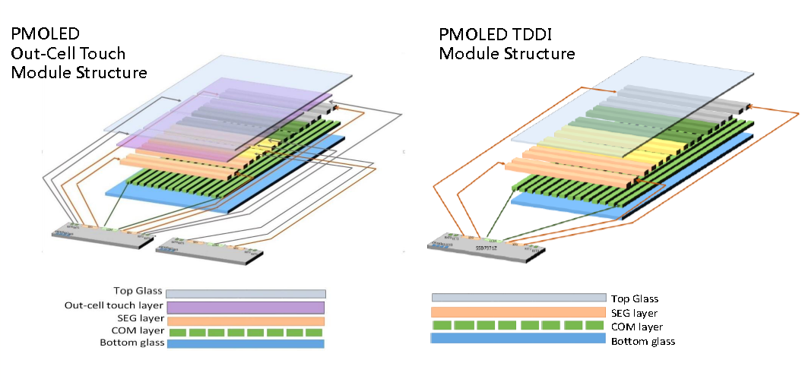
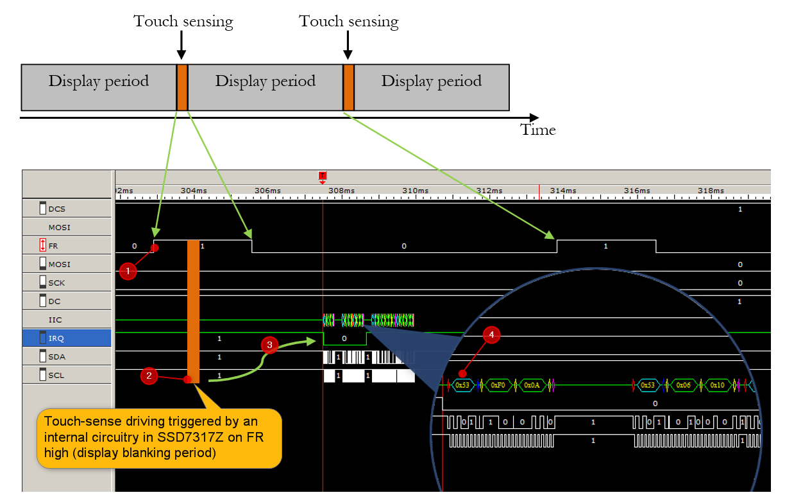

# SSD7317Z
is a controller IC designed by [Solomon Systech Ltd.](https://www.solomon-systech.com/) with touch screen and display controller circuits fabricated on the same die. Photo below shows a conventional *out-cell* screen with separated touch screen and LCD module on the left versus the *in-cell* screen with a single Touch and Display Driver Integration (TDDI) IC driver on the right.

Out-cell solution uses a highly conductive and optically transparent Indium Tin Oxide (ITO) printed as grids on a substrate to sense our fingers for changes in capacitance. The substrate is bonded to the top glass of the LCD module by some optically clear adhesive [OCA](https://en.wikipedia.org/wiki/Liquid_optically_clear_adhesive). A major advantage of using out-cell is flexibility: designers have the freedom to mix different types of touch screen with a LCD module for different designs. Disadvantages include a larger thickness and weight because the touch substrate is a separate layer that needs OCA to bond it to top of the LCD module. Additional manufacturing processes also imply longer production time and more parts for quality assurance leading to higher production cost and yield risks.

Novel in-cell solution eliminates the touch layer altogether. Because there is no external substrate carrying the ITO sensing grids required, it turns out a thinner display with better light transmittance can be made. Figure below illustrates the structural difference.

The question is how capacitive sensing is performed without an ITO layer? The silicon designer came up with an answer to assign dual functions to the SEG and COM electrodes - for display driving and touch-sense driving. A Time Multiplex Driving Scheme is used to divide display driving and touch sensing period in each frame as shown below.

|                           Marker                           | Description                                                  |
| :--------------------------------------------------------: | ------------------------------------------------------------ |
|  | Display period is started by the onset of a sync pulse on the frame synchronization pin (FR)  as the blanking period (2.7ms) |
|  | Touch-sense driving is triggered by internal circuitry of SSD7317Z in the blanking period |
|  | On a valid touch event, an active-low output signal on the IRQ pin is generated by SSD7317Z with touch and gesture informations encapsulated in form of I2C messages (touch report) waiting for readout |
|  | The IRQ signal is handled by the MCU as an interrupt source and the MCU starts reading the touch report |

As yet, do not worry too much on the inner workings and how the waveforms were captured such as why the first I2C frame is 0x53 0xF0 0x0A, etc. They will be fully described in following sections with details on setup, source code, and protocol of the touch report.

## Our First PMOLED TDDI Display Module - UT2896KSWGG01

is a passive matrix OLED display of 96*128 monochrome with 4 in-cell touch keys, 1-D slide gesture detect and 4 outside keys fabricated by [WiseChip Semiconductor Inc.](https://www.wisechip.com.tw/en/)

## Hardware Interface to PMOLED Module

## An Evaluation Board

To facilitate the tasks of testing and development, I have designed an evaluation board with the following features:

1. Compatible pin headers for a low-cost and standard evaluation kit of ST MCU [STM32L432KC](https://www.st.com/en/microcontrollers-microprocessors/stm32l432kc.html)
2. Onboard 12V DC-DC generator of Texas Instruments [TPS61040](https://www.ti.com/product/TPS61040) for VCC of the PMOLED module
3. Adjustable LDO [AP2127K-ADJTRG1](https://www.mouser.hk/ProductDetail/Diodes-Incorporated/AP2127K-ADJTRG1/?qs=x6A8l6qLYDB9dJkf7MndUg==) for VCI and VDD so that you may change the voltage output to fit your application processor, just in case it is different from 3.3V
4. Buzzer with a simple NPN driving circuit for audio feedback
5. Test points across major power rails (VCC, VCI, VDD) for measurements on current ratings

The full schematic of the evaluation board is found from this repository at this [link.](./Schematics/UT-2896KSWGG01-WiseChip-EVK-Sch.pdf)

## Setting Up the Integrated Development Environment (IDE)

STM32CubeIDE is an all-in-one development tool released by STMicroelectronics. It is available for 3 operation systems: Linux (Debian, Generic, RPM), macOS, and Windows. Full details on the system requirements and installer packages are available from the hyperlink below:

https://www.st.com/en/development-tools/stm32cubeide.html#get-software

At time of writing the latest version of STM32CubeIDE was 1.5.1. In this book, all examples have been compiled, linked and tested with no error with the host PC running 64-bit Windows 7 and Windows 10, and all programs are confirmed to run on target development board.

## Download and Build the Hello World Project

## How It Works

## Porting the Driver to Your MCU

