# Contents
## [Introduction](#Introduction)
## [PMOLED Module](#our-first-pmoled-tddi-display-module)
## [Hardware Interface to PMOLED Module](#hardware-interface-to-pmoled-module)
## [An Evaluation Board](#an-evaluation-board)
## [Setting Up the IDE](#setting-up-the-integrated-development-environment)
## [Download and Build the Hello World Project](#download-and-build-the-hello-world-project)
## [How Hello World Works](#how-hello-world-works)
## [LCD Image Converter](#lcd-image-converter)
## [Create a New Project](#create-a-new-project)
## [The Touch Screen and How It Works](#the-touch-screen-and-how-it-works)
## [Infinite Content Scrolling](#infinite-content-scrolling)
## [Porting the Driver to Your MCU](#porting-the-driver-to-your-mcu)
---
## Introduction
**SSD7317Z** is a controller IC designed by [Solomon Systech Ltd.](https://www.solomon-systech.com/) with touch screen and display controller circuits fabricated on the same die. The photo below shows a conventional *out-cell* screen with a separated touch screen and LCD module on the left versus the *in-cell* screen with a single Touch and Display Driver Integration (TDDI) IC driver on the right.

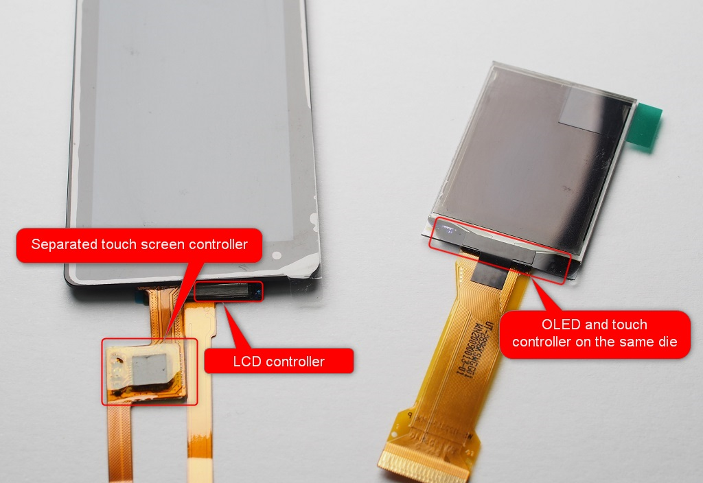

An *out-cell* solution uses a highly conductive and optically transparent Indium Tin Oxide (ITO) printed as grids on a substrate to sense our finger for changes in capacitance. The substrate is bonded to the top glass of the LCD module by some optically clear adhesive [OCA](https://en.wikipedia.org/wiki/Liquid_optically_clear_adhesive). A major advantage of an *out-cell* is flexibility: engineers have the freedom to mix different types of touch screens with an LCD module for different designs. Disadvantages include a larger thickness and weight because the touch substrate is a separate layer that needs OCA to bond it to the top of the LCD module. Additional manufacturing processes also lead to longer production time, more complex quality assurance, higher production cost,and yield risks.

Novel *in-cell* solution eliminates the touch and OCA layers. Because there is no external substrate carrying the ITO sensing grids, it turns out a thinner display with better light transmittance can be made. The figures below highlight the difference between the *out-cell* and *in-cell* structures.


## Our First PMOLED TDDI Display Module
UT2896KSWGG01 is a passive matrix monochrome OLED display of 96*128 with 4 in-cell touch keys, 1-D slide gesture detect and 4 outside keys fabricated by [WiseChip Semiconductor Inc.](https://www.wisechip.com.tw/en/) This repository describes how the novel in-cell display module is interfaced to a popular STM32 M4 MCU and the display and touch drivers developed.

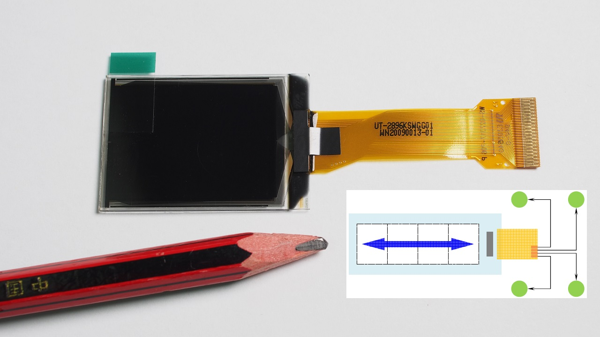

## Hardware Interface to PMOLED Module

Two interface types are required to drive the PMOLED module: SPI for display and I2C for touch screen. There are also GPIOs required for interrupts for FR (frame synchronization) and IRQ (touch event).


## An Evaluation Board

To facilitate the tasks of testing and development, we have designed an evaluation board with the following features:

1. Compatible pin headers for a low-cost and standard evaluation kit of ST MCU [STM32L432KC](https://www.st.com/en/microcontrollers-microprocessors/stm32l432kc.html)
2. Onboard 12V DC-DC generator of Texas Instruments [TPS61040](https://www.ti.com/product/TPS61040) for VCC of the PMOLED module
3. Adjustable LDO [AP2127K-ADJTRG1](https://www.mouser.hk/ProductDetail/Diodes-Incorporated/AP2127K-ADJTRG1/?qs=x6A8l6qLYDB9dJkf7MndUg==) for VCI and VDD so that you may change the voltage output to fit your application processor, just in case it is different from 3.3V
4. Buzzer with a simple NPN driving circuit for audio feedback
5. Test points across major power rails (VCC, VCI, VDD) for measurement of current ratings

The full schematic of the evaluation board is found from this repository at this [link.](./Schematics/UT-2896KSWGG01-WiseChip-EVK-Sch.pdf)


## Setting Up the Integrated Development Environment

STM32CubeIDE is an all-in-one development tool released by STMicroelectronics. It is available for 3 operation systems: Linux (Debian, Generic, RPM), macOS, and Windows. Full details on the system requirements and installer packages are available from the hyperlink:

https://www.st.com/en/development-tools/stm32cubeide.html#get-software

At the time of writing the latest version of STM32CubeIDE was 1.5.1. I am using an old version 1.2.0 with updates but it should be compatible with the latest version. In this repository, all examples have been compiled, linked, and tested with no error with the host PC running 64-bit Windows 7 and Windows 10, and all programs are confirmed to run on the evaluation board.

In my environment the installation path is set to **C:\ST\STM32CubeIDE_1.2.0** by following the default option. However, you may use any path you find convenient. In the installation procedures, you will be asked whether to install the SEGGER J-Link drivers, ST_LINK drivers, and ST-LINK server. Check ST_LINK drivers and ST-LINK server with SEGGER J-Link drivers optional. After installation, a desktop shortcut is created.


The STM32CubeIDE is based on [Eclipse](https://en.wikipedia.org/wiki/Eclipse_(software)) that uses a directory called *workspace* to store its preferences and configurations. Every time you run STM32CubeIDE, you will see a dialog box similar to the screen capture below to ask you for the workspace location. In my case, I just follow the recommended path at **C:\Users\John\STM32CubeIDE\workspace_1.2.0** with *John* as my computer user name. It is not mandatory to set the workspace in C drive. You may use another directory at your convenience. From now on, I will refer to your installation path as *[your path]*.


Installation of STM32CubeIDE is a straightforward procedure. If you happen to have an issue, the [ST community](https://community.st.com/s/topic/0TO0X000000y2j7WAA/stm32cubeide) is a good place to ask for assistance.

## Download and Build the Hello World Project

Full source code is available from GitHub at https://github.com/techtoys/SSD7317Z. By expanding the button followed by **Download ZIP**, you will get a compressed file "**SSD7317Z-main.zip**".


Unzip the file to any location you like.


Return to STM32CubeIDE, right click on **Project Explorer > Import > General > Existing Projects into Workspace > Next**. From the Import Wizard, click **Browse**  to select the root directory of **HelloWorld** . The project path will be automatically resolved. Click **Finish**  to confirm.


You will see **HelloWorld** under **Project Explorer**. Everything seems fine except there is a yellow exclamation mark on the folder icon of SSD7317Z that means STM32CubeIDE has failed to resolve its location. It is because the device driver of SSD7317Z is located outside of the HelloWorld project as a shared library. Its relative path was set correctly in my PC but it is not set in your environment yet.


To fix the issue, you need to set two variables: **Path Variables** and **Build Variables**. Right click on the project title, from the pop-up menu, click on **Properties**.


Expand **Resource > Linked Resources > Path Variables**. Highlight on **SSD7317Z** and click on the **Edit** button to point the path variable of SSD7317Z to the *\Drivers* folder that is the root containing the header *\Inc* and source *\Src* folders of SSD7317Z.


Next, expand **C/C++ Build** > **Build Variables** > set SSD7317Z directory to *\Drivers* folder for Debug and Release configurations. Close by clicking the **Apply and Close** button. You will see the exclamation mark is now resolved to an arrow indicating a relative path.


Now you have successfully configured the IDE. The last step is to build the project by clicking on **Project > Build All** from the IDE's menu bar. Make sure there is no error and observe that HelloWorld.elf and .bin files are built correctly. The files are required for debugging and standalone operations.


To run the project on hardware, connect the MicroUSB port of NUCLEO STM32L432KC to your PC. On the first-time connection, you may be asked to upgrade the ST Link firmware and it is no harm to do it.

Click on **Run > Debug** or **F11**, or click on the ladybug icon followed by running the project with **Run > Resume** or **F8**.


In 1-2 seconds you will see the PMOLED show **Hello World** on it.

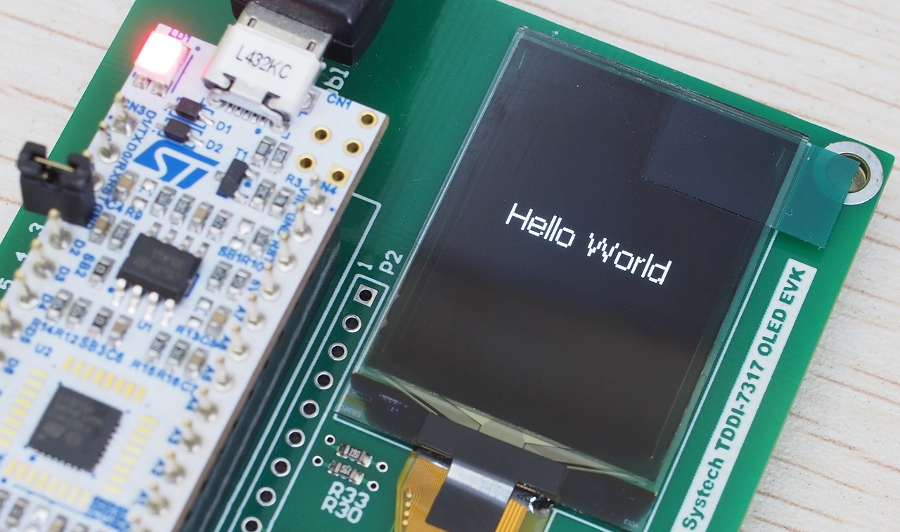

## How Hello World Works
### Pin Assignment

The wiring diagram between Nucleo L432KC and PMOLED for the display part is shown below.

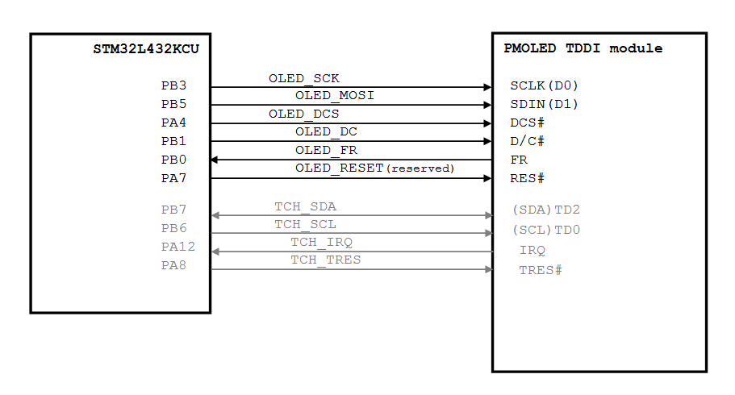

We need four wires (4-wire SPI) to drive the PMOLED. They are 

- OLED_SCK (serial clock)

- OLED_MOSI (master out slave in)

- OLED_DCS (chip select)

- OLED_DC (data/command selection)

There is no MISO (master in slave out) because the PMOLED is a unidirectional device - SPI data flow from the master (MCU) to slave (PMOLED) only, i.e., it is a half-duplex SPI device. 

GPIO PB0 is allocated as an external interrupt detection pin for the display blanking signal (FR) of the OLED module. This pin is optional but highly recommended to avoid display tearing.

Allocation of PA7 as the reset pin is optional because it is required only in system startup. We can afford it since there are spare pins available. If we need to save some MCU pins for future designs, it is possible to use a dedicated reset IC (e.g. STM6321) for the same function. On the evaluation board, that function is performed by a simple RC circuit.

The touch screen interface and its pinout are covered in the section [Touch Screen](#the-touch-screen-and-how-it-works) later. 

### SPI Transfer

The figures below show the SPI timing tables and diagrams excerpt from the OLED's datasheet. Data transmission occurs when DCS# goes low and data is latched on the rising edge of the serial clock with the most significant bit (MSB) first. The line D/C# controls whether the byte is a command (D/C#=0) or data (D/C#=1). 


In the source code, two functions: `spi_write_command()` and `spi_write_data()` for command write and data write are provided. OLED (display part) initialization is configured by `spi_write_command()` and pixels are written with `spi_write_data()`.

```c
/**
  * @brief 	SPI command write (non-DMA).
  * @param 	*command points to the command array to send.
  * @param	len is the data length in byte count.
  * @return None
  */
void spi_write_command(const uint8_t *command, uint16_t len){
	/*DC pin set low for command send*/
	HAL_GPIO_WritePin(OLED_DC_GPIO_Port, OLED_DC_Pin, GPIO_PIN_RESET);
	/*SPI send with non-DMA method = blocking transfer*/
	HAL_SPI_Transmit(&hspi1, (uint8_t *)command, len, 10);
}
```

```c
/**
  * @brief 	SPI data write (non-DMA).
  * @param 	*data points to the data array to send.
  * @param	len is the data length in byte count.
  * @return None
  */
void spi_write_data(const uint8_t *data, uint16_t len){
	/*DC pin set high for data send in next SPI transfer*/
	HAL_GPIO_WritePin(OLED_DC_GPIO_Port, OLED_DC_Pin, GPIO_PIN_SET);
	/*SPI send (non-DMA) = blocking function*/
	HAL_SPI_Transmit(&hspi1, (uint8_t *)data, len, 10);
}
```

### Graphic Display Data RAM
In SSD7317Z there is a memory region known as the Graphic Display Data RAM (GDDRAM) that is mapped to each pixel in one-bit depth. The size of GDDRAM is 12*128 bytes with memory divided into 12 pages (PAGE0-PAGE11) with PAGE0 spans from COM95 to COM88, PAGE1 from COM87 to COM80, down to PAGE11 from COM7 to COM0. The memory map on UT2896KSWGG01 is shown below.


The mapping orientation and data scanning direction are configurable by the initialization code that we will go through in the [Program Listing](#program-listing) section. There is a confidential document on **[Data Write Direction](./Docs/SSD7317_128x64_Truly_dataWriteDirection_ToTechtoy.pdf)** if you are interested to change the orientation. 

Transferring one byte (8-bit) to GDDRAM with D/C# line driven high are displayed as pixels across the same page. Which page to address is controlled by start-page address and end-page address with code snippet:
```C
const uint8_t cmd[3]={0x21,0x00,0x00}; //1) 0x21=SEGMENT address set, 0x00=Start SEGMENT, 0x00=End SEGMENT
spi_write_command((const uint8_t*)cmd, 3); //2) Set SEGMENT address

cmd[0]=0x22; //3) 0x22=COM address set, cmd[1]=cmd[2]=0x00 (no change)
spi_write_command((const uint8_t*)cmd, 3); //4) Set COM address 

const uint8_t data=0xff;
spi_write_data((const uint8_t*)&data, 1); //5) Write pixels
```

Running the code above will switch 8 pixels at the top left corner to WHITE like this:

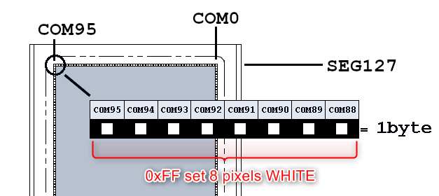


**Explanation:**

1. `const uint8_t cmd[3]={0x21, 0x00, 0x00}` assigns an array with three elements, the first element `0x21` is the command to set SEGMENT address. The second `0x00` sets the start of the SEGMENT address at SEG127. The third `0x00` sets the end of the SEGMENT address, in our case, it is also 0 because we are going to set the first PAGE (COM95:COM88) only. Suppose we need to display on two PAGEs across the horizontal direction, the array becomes `const uint8_t cmd[3] = {0x21, 0x00, 0x01}`.

2. `spi_write_command((const uint8_t*)cmd, 3)` sends command with D/C# line driven low. 

   > **NOTE:** There is no need to drive D/C# level high for parameters after 0x21. This is different from other OLED drivers like [SSD1355](http://www.techtoys.com.hk/PIC_boards/PIC18%20OLED%20EVK/PIC18%20OLED%20EVK.htm). The command and subsequent parameters are sent straight through ***without*** D/C# line toggle between 0 and 1.

3. Line 3 `cmd[0]=0x22` sets COM address with `cmd[1]=cmd[2]=0x00` (no change).
4. Line 4 `spi_write_command((const uint8_t *)cmd, 3)` sends over `0x22 0x00 0x00` to set the COM address to the first PAGE.
5. In Line 5, `spi_write_data((const uint8_t*)&data, 1)` is applied to send 0xFF over with D/C# driven high. Result: eight pixels across the horizontal direction are set to WHITE.

### Send command by Remote Procedure Call (RPC)

There is a Remote Procedure Call function (`rpc_main_task()`) running in the main loop to convert all serial commands to their equivalent SPI commands. You may download a serial terminal program YAT (YET Another Terminal) from [SOURCEFORGE](https://sourceforge.net/projects/y-a-terminal/) and get it installed. 

Keep the **HelloWorld** program running in debug mode, launch YAT and make sure **Port Settings** (under Terminal Settings) is set to the **STLink Virtual COM Port** enumerated in your PC. In my case it is COM96 but it would be different in your environment. Set baud rate to **115200, 8-n-1** with Flow Control set to None. Terminal Type set to **Text** and Port Type set **Serial COM Port**.


Click **Text Settings...** button to proceed. Set Encoding to some common standard available on your PC. In my case, ASCII(ISO646-US) works fine.

From **EOL (End-Of-Line)**, check **Separate EOL sequences for Tx and Rx** and set \<CR>\<LF> as the EOL sequence. Click **OK**  twice to go back to the main menu. 

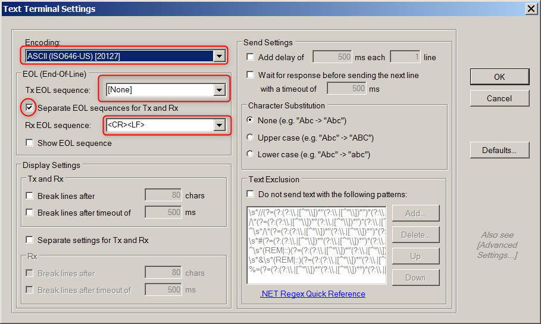

Click **Open/Start Terminal** button 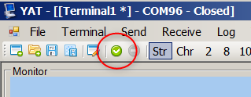, check **Str** to display ASCII string in Monitor window. In **Send Text** dialog box, type in `\h (7E 21 00 00 22 00 00)` and click **Send Text (F3)**. 

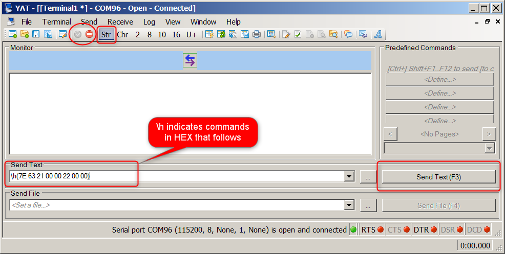

After **Send Text** you will see the original command echo in the Monitor Window. Toggle between **Str** and **16** to view the difference in String and HEX code.

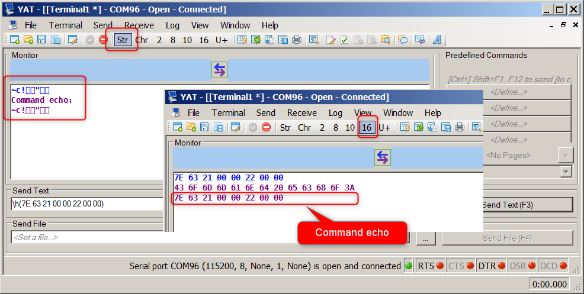 

**Annotation:**

`\h` set HEX format in bracket `(...)`

`7E 63` is the header for subsequent characters with `spi_write_command(arg)`

`21 00 00 22 00 00` is the body of the command to send. In this case, we are sending six bytes in one SPI transfer to set to the start of Segment (SEG=127) and COM address set 0.

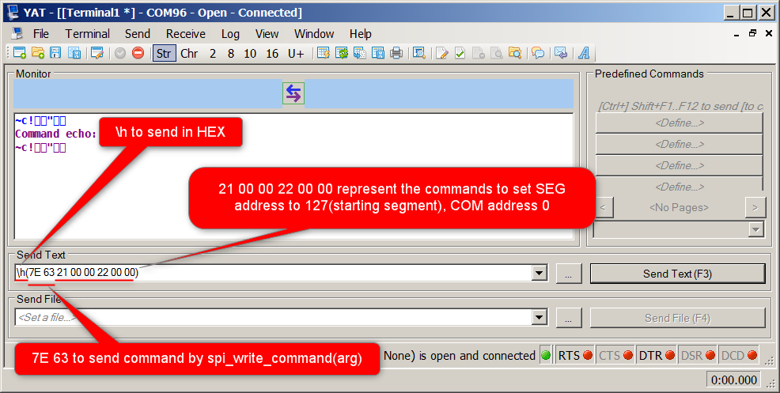

Now, type in `\h (7E 64 FF)`  with command header changed to `64` for data and click **Send Text**. You will see 8 pixels at the top left corner with the serial command converted to `spi_write_data(0xff, 1)`.

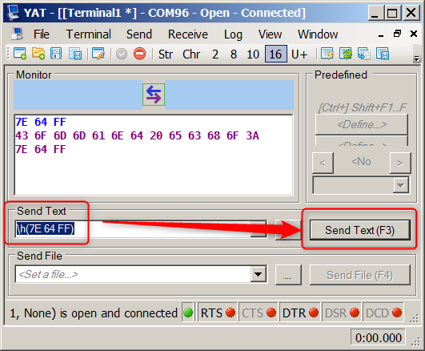

Close-up on OLED:

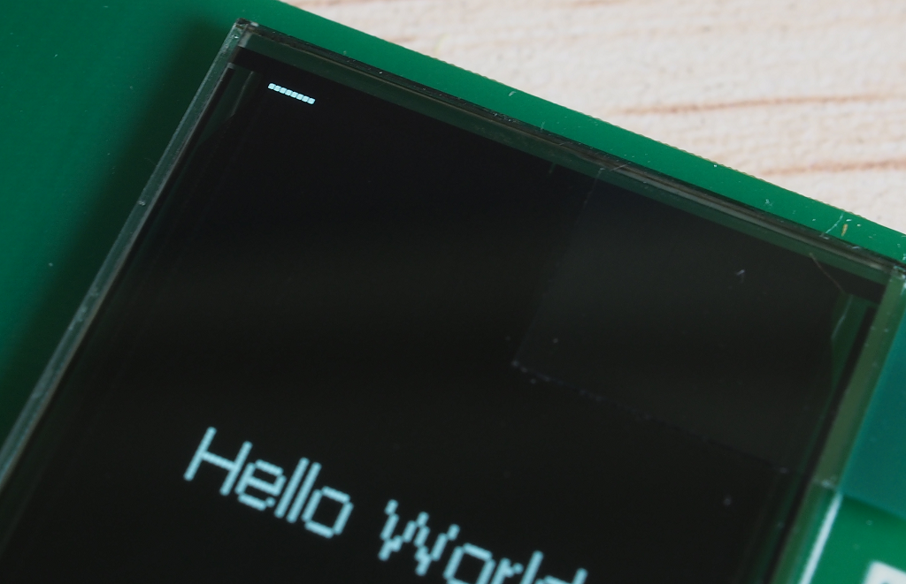

Type in `\h(7E 64 86)`, click **Send Text**.

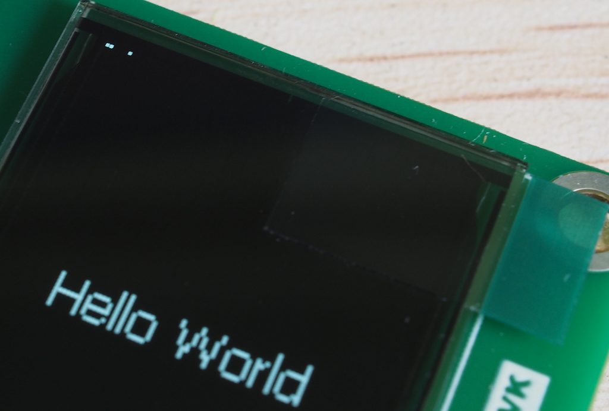

Type in `\h(7E 63 21 00 00 22 00 01)` **Send Text** to bound to two PAGEs in horizontal follow by`\h(7E 64 FF 86)` **Send Text**. Sixteen pixels are displayed with 0xFF as the first 8 pixels, 0x86 as 01100001 with 0=BLACK, 1=WHITE.

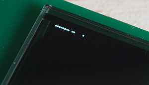

Type in `\h(7E 63 21 01 01 22 00 01)` **Send Text** to set it to the second segment (SEG=126) and bound the area to two PAGEs, follow by`\h(7E 64 FF 86)` **Send Text** to write the same 16 pixels to the second row.

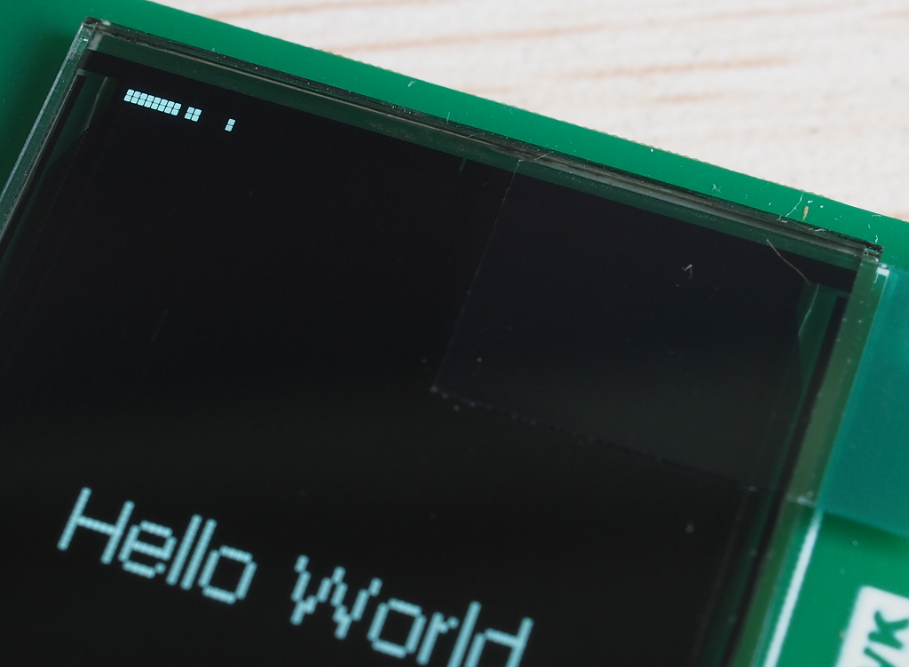

> **NOTE:** The top left corner is initialized to (COM95, SEG127) with data write direction set COM95 as the least significant bit (LSB), i.e. byte orientation in LSB first. Because the SPI sending direction was set to MSB first, all data sent is laterally inverted: data write in 0x86 is displayed as a bit pattern like 01100001 with 1=WHITE, 0=BLACK.

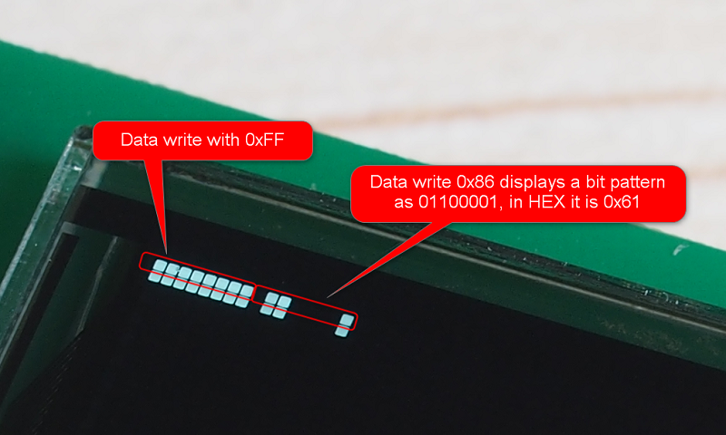

### Program Listing

Coming back to the program, the listing below shows the code snippet of **HelloWorld**.  There are only 7 lines required to run this program.

```c
int main(void)
{
  HAL_Init(); //1
  SystemClock_Config(); //2
  ssd7317_init(); //3
  rpc_uart_init(); //4
    
  uint16_t w, h;
  ssd7317_get_stringsize(&Tahoma_12h, "Hello World", &w, &h); //5
  ssd7317_put_string((OLED_HOR_RES-w)/2,(OLED_VER_RES-h)/2, &Tahoma_12h,"Hello World",0); //6
  while (1)
  {
	rpc_main_task(); //7
  }
```

**Explanation:**

1. Function `HAL_Init()` is automatically generated by **STM32CubeIDE** to reset all peripherals and initialize the Flash interface of the MCU.  With a **HAL_** prefix it means the function comes from the hardware abstraction layer (HAL).
2. `SystemClock_Config()` is also automatically generated by **STM32CubeIDE** to initialize the system clock of the MCU.
3. `ssd7317_init()` is the initialization function of SSD7317Z.
4. `rpc_uart_init()` is the function to initialize the Remote Procedure Call (RPC) module that allows us to input commands from YAT to control the OLED. 
5. Function `ssd7317_get_stringsize(&Tahoma_12h, "Hello World", &w, &h)` returns the width and height of the string `Hello World` from the font `Tahoma_12h` defined in a header file **Tahoma_12h.h**. I will explain how to create the file in the next section [LCD Image Converter](#lcd-image-converter).
6. `ssd7317_put_string((OLED_HOR_RES-w)/2,(OLED_VER_RES-h)/2, &Tahoma_12h,"Hello World",0)` is the key function to align `Hello World` in the center of the screen, update the frame buffer, and get the string displayed on the next FR event. 
7. `rpc_main_task()` is the task of RPC that runs periodically (polling) in the infinite loop.

### The Frame Buffer

The third parameter of the function call to `ssd7317_put_string(left,right,&Tahoma_12h, "Hello World",0)` above is a reference to the structure `const tFont Tahoma_12h` which store 95 characters in the MCU's non-volatile FLASH space. Data elements of character **H** in **Hello World** are:

```c
//0x48 is the ASCII code of H, expand the file Tahoma_12h.h and make a search
static const uint8_t image_data_Tahoma_12h_0x48[14] = { 
    0x00, 
    0x00, 
    0x00, 
    0x41, 
    0x41, 
    0x41, 
    0x41, 
    0x7f, 
    0x41, 
    0x41, 
    0x41, 
    0x41, 
    0x00, 
    0x00
};
```
From a broad perspective, we just need to transfer the byte pattern of **H** `{0x00 0x00 0x00 0x41 ...0x00}` from the MCU's FLASH to OLED's GDDRAM by calling `spi_write_data()` and repeat the function for the remaining characters to get **Hello World** displayed.
 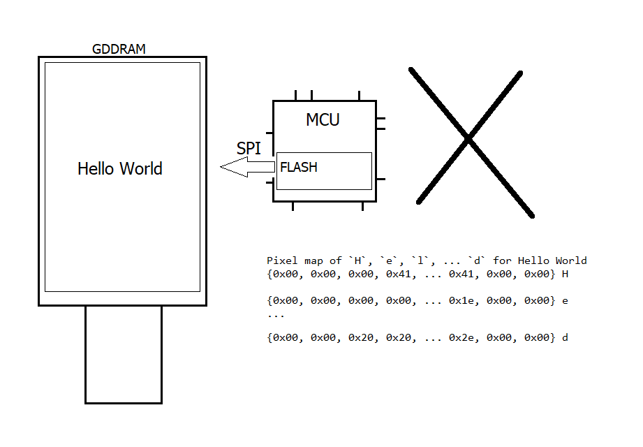
We have a custom-made function for that (in **SSD7317.c**):

`void ssd7317_put_image_direct(uint16_t left, int16_t top, const tImage* image)`.

It is a simple approach to draw characters and images but there an issue with this approach - there is no buffer for the graphical contents. To display **Hello World** in the example above, the MCU will repeat the same character rendering procedure for eleven iterations across the screen and you will see pixels raster across the screen.

To solve these problems, a frame buffer is declared from MCU's SRAM as a map to the OLED's GDDRAM. Pixels are not written directly to the screen; instead, any graphical content to be updated is written to the frame buffer first and the modified contents in `frame_buffer[]` are flushed from SRAM to GDDRAM by SPI transfer on an FR rising edge to synchronize the blanking period of the OLED. With this approach, the speed of data transfer is faster because it is now data copy from SRAM to OLED's GDDRAM. DMA can be applied to further shorten SPI transfer latency. Synchronization to an FR rising edge also avoids display [tearing](https://en.wikipedia.org/wiki/Screen_tearing). 

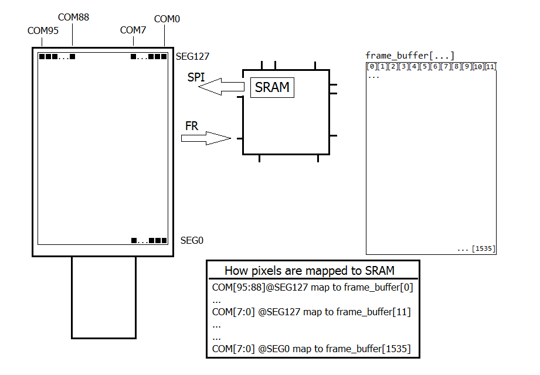

For a small display of 96*128 pixels in black and white, the frame buffer occupies an extra 1.5KB out of 64KB SRAM in our target MCU. A more advanced approach is to port the library to some modern graphical frameworks. Examples are [TouchGFX](https://www.st.com/content/st_com/en/stm32-graphic-user-interface.html) and [LVGL](https://lvgl.io/) and both of them need a frame buffer too.

Listing below shows the code snippet of the GPIO external interrupt detection callback that listens to an FR rising edge. The FR signal is an output signal triggered by SSD7317Z in each blanking period of the OLED, which means it is a perpetual output signal determined by the frame rate of the OLED.

```c
//EXTI callback function in SSD7317.c
void HAL_GPIO_EXTI_Callback(uint16_t GPIO_Pin) 
{
	if (GPIO_Pin==OLED_FR_Pin)// FR signal synchronized
	{	// Copy frame buffer to GDDRAM on-the-spot of this interrupt callback if there is pending data to flush
		if(fb_flush_pending_get()){
			fb_spi_transfer(fb_flush_area);
		}
	}
}
```

On an FR-rising edge if there is pending data to flush `(fb_flush_pending_get()==true)`, the function `fb_spi_transfer()` is called to copy `frame_buffer[area]` from MCU's SRAM to OLED's GDDRAM via SPI.

The waveform to draw on the screen for the string **Hello World** was captured by a Logic Analyzer shown below.

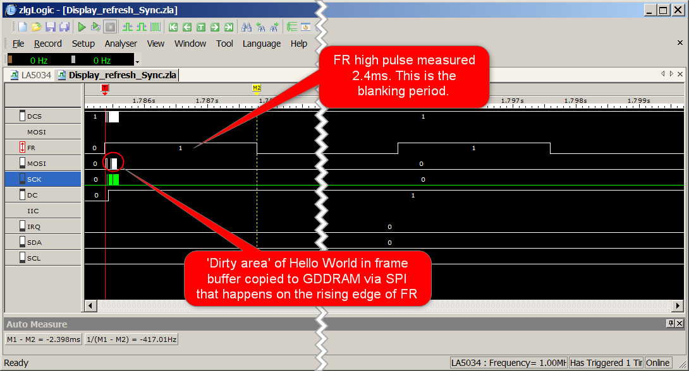

By boosting the Logic Analyzer's sampling rate to 100MHz (SPI frequency is 16MHz), we can close up on the SPI data that got written starting from segment address set `0x21`.

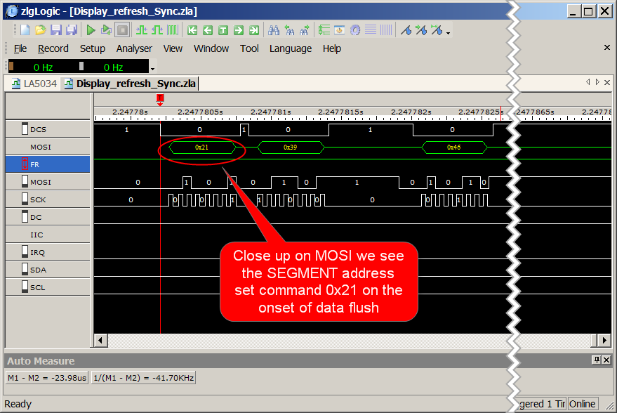

To wrap it up, the program works by copying the bit patterns of the string **Hello World** from FLASH to the frame buffer `(frame_buffer[])`, then a flag is set for flush pending to wait for an FR rising edge. On an FR rising edge, the HAL function `HAL_SPI_Transmit()` is applied to copy the dirty area of the frame buffer to GDDRAM of the OLED by SPI.
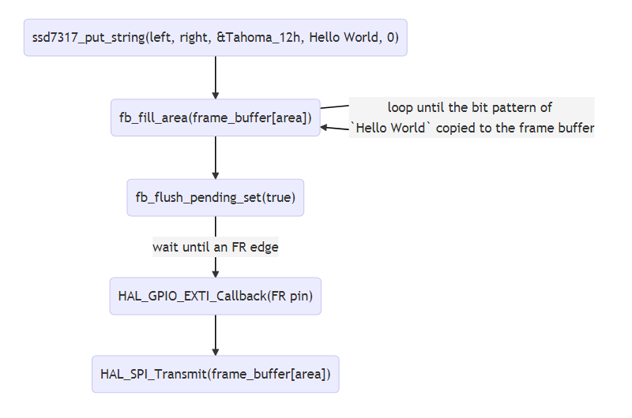

## LCD Image Converter

is a shareware to create bitmaps and fonts and convert them to "C" source format for embedded applications. It is available from [SOURCEFORGE](https://sourceforge.net/projects/lcd-image-converter/). This section describes the procedures to prepare bitmaps and fonts in "C" arrays and use them in a new project from scratch. 

### Create Fonts in "C" Array

Download and install LCD Image Converter. Double click on **lcd-image-converter.exe**  to launch the application and click **New Font** button.

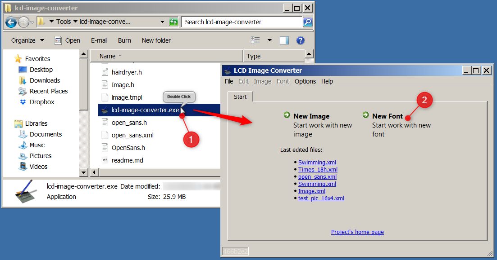

Enter the font name you want to use. I would suggest a convention that can indicate the font type and size, e.g. ArialBlack_36h.

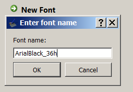

From **Font setup** dialog box, select the target Fontand Size. I am using Arial Black in size 36 here. By default, the whole typeable character range (0x20 - 0x7E) is selected. To expand or restrict the range, click on the **Characters** button from the lower left corner.

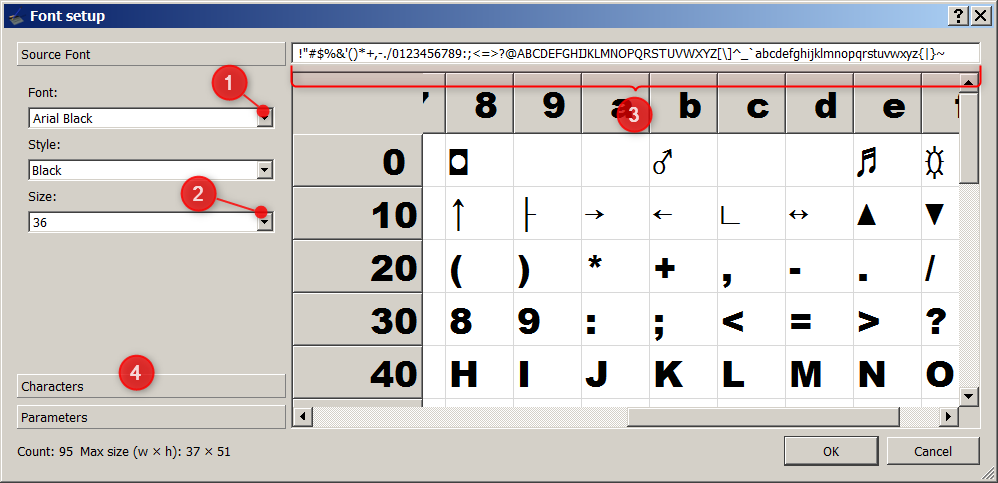

The **Filter** section is now available, select **All**. Matrix table on the right panel is refreshed with the full character range (0x00 - 0xFFFF). In this example, I am going to use only digit "0" - "9" and few special characters. From the text box (next to the **Source Font** button), highlight and delete characters from "space" to "/" and characters ":" to "~" leaving only "0123456789".


To furnish this example, I want to add some Unicode characters to the list. Scroll down the table to select any character you need with double-clicks. I am using Unicode characters 0x26f7, 0x2ee4, 0x30b5, 0x3179, and 0x3296 as demonstration. See the text box is refreshed with new characters added.

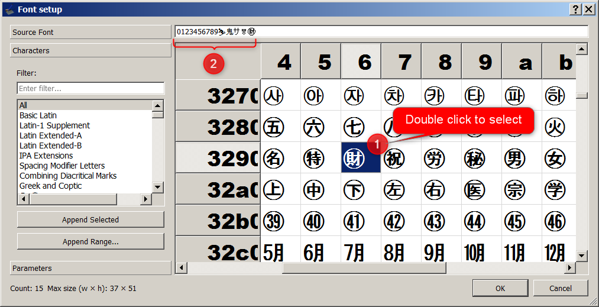

Next, click on the **Parameters** button and select Proportional with ForeColor set 0xffffffff and Black Color set 0xff000000. There is no anti-aliasing required because our OLED is a monochrome display.

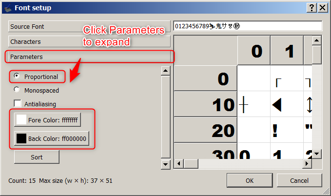

Click **OK** to exit.

Now, the main menu of LCD Image Converter will show all characters selectedon the right with zoom up on the left.  From Options>. From  the **Options** menu, click on **Conversion...** to open the **Options** dialog menu.

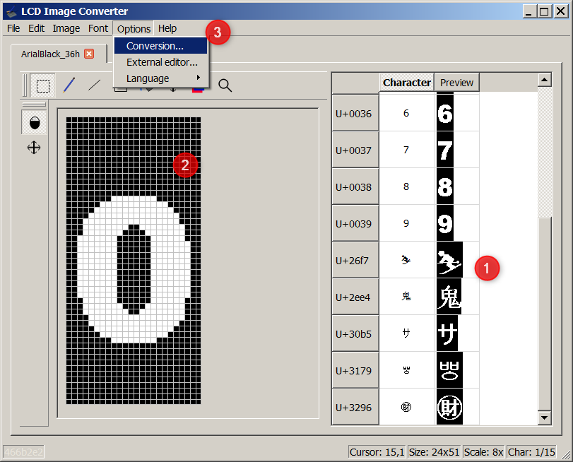

Select **Monochrome** in Preset drop-down menu. Under the **Prepare tab** select **Monochrome**, **Top to Bottom** as the main scan direction and **Forward**as the line scan direction.

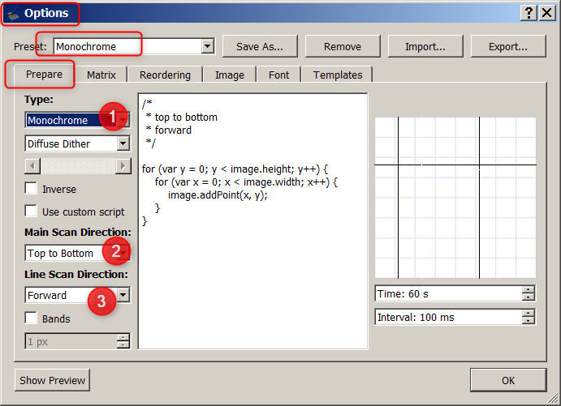

**Here comes the tricky part:** we need to laterally invert the bit positions because **pixels are mapped in LSB first** in the [GDDRAM map](#graphic-display-data-ram).

Stay in the **Options** dialog menu, select **Reordering tab** and click on the bit '0' button from the Source row and add "Left Shift" by 7 bits. This action is to add a new bitwise operation to shift LSB bit (bit 0) to the MSB position at bit 7.

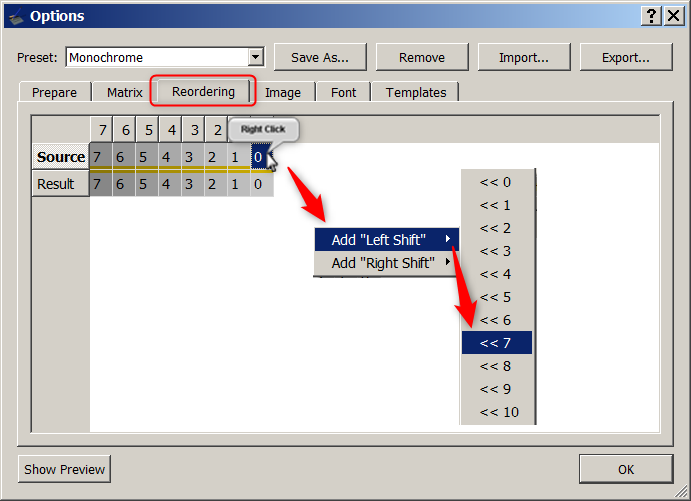

Repeat the procedures by clicking on the bit '1' and left shift by 5 (<<5), on bit '2' and left shift by 3 (<<3), on bit '3', and left shift by 1 (<<1), on bit '4' and right shift by 1 (>>1), on bit '5' and right shift by 3 (>>3), on bit '6' and right shift by 5 (>>5), and finally on bit '7' and right shift by 7 (>>7). 

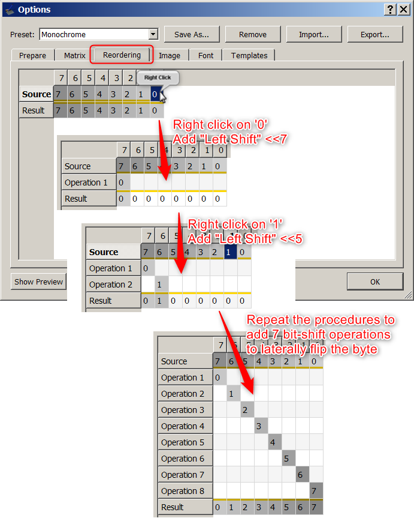

The result of the series of operations will laterally flip the byte `0b76543210` to `0b01234567`. 

Click **OK** to exit.

Screen captures of the other tabs under **Options** are shown below for reference. An important parameter is **UTF-16** for **Encoding** under **Font tab** because in our list there are Unicode characters.

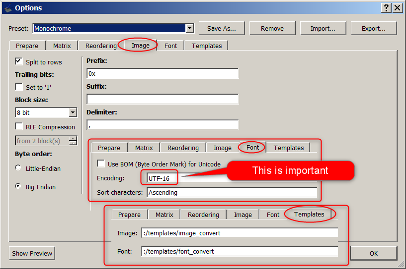

Click **OK** to exit. 

Finally, click on **File > Convert**, use the suggested file name **ArialBlack_36h.h** to save it as type C/C++ headers (*.h). You may also save the project to ArialBlack_36h.xml from **File > Save** for later use.

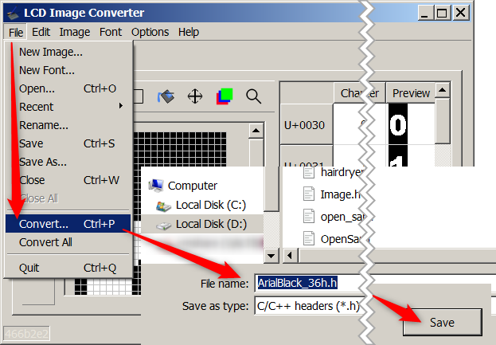

### Create Bitmaps in "C" Array 

The procedures to convert a bitmap to "C" Array are similar. On the starting page, open the bitmap file to convert from **File > Open**.

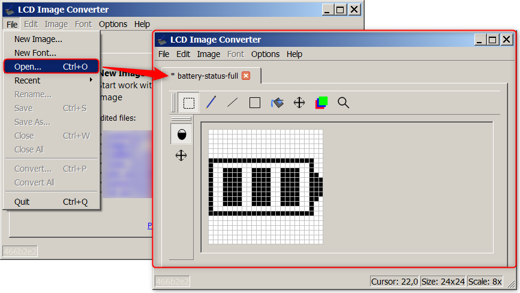

Inspect the conversion parameters from **Options > Conversion**. Make sure the same laterally inverted operation from the last font creation process is applied. Click on **Show Preview** button.

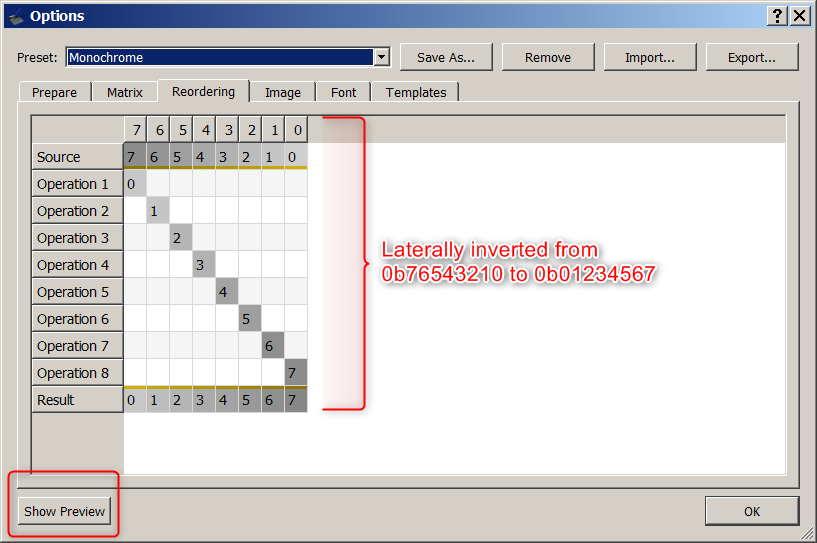

The **Preview** page will show the "C" array starting with 0xff. Data pattern in this configuration will show a black image on a white background since the OLED is initialized with 1 as WHITE and 0 as BLACK.

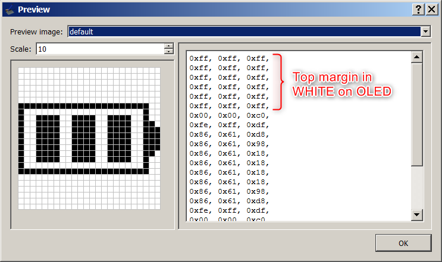

We may change it by checking the **Inverse** checkbox from the **Prepare** tab. Click on **Show Preview** again to verify the final "C" array is now with a BLACK(0) background.

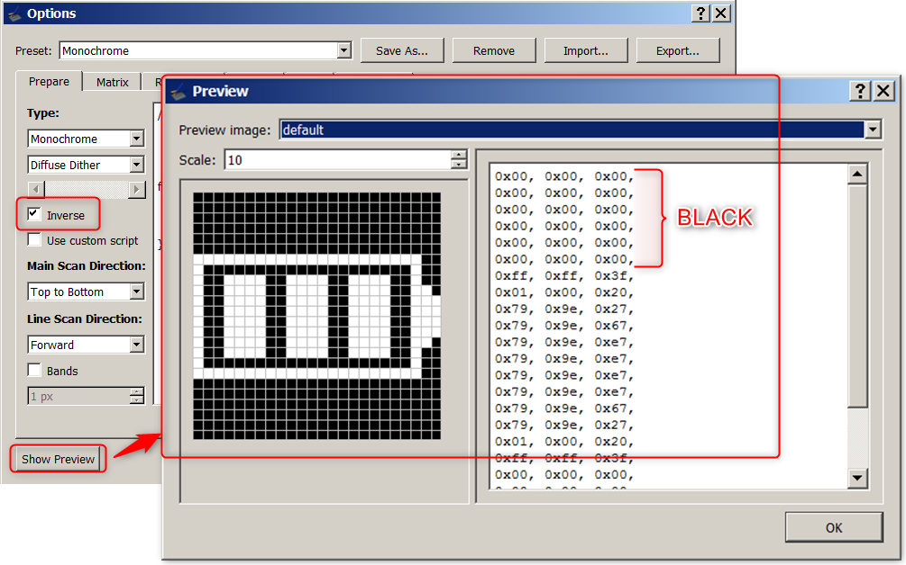

Click **OK** twice to exit and save changes when you are asked to do so. 

Finally, convert it to a "C" array by **File > Convert** and save it to the suggested filename **battery-status-full.h**.

## Create a New Project

In this section, we are going to create a new project to display the font and bitmap with "C" arrays from the last section. 

Launch STM32CubeIDE. Right click on any empty area on **Project Explorer > New > STM32 Project from an Existing STM32CubeMX Configuration File (.ioc)**.

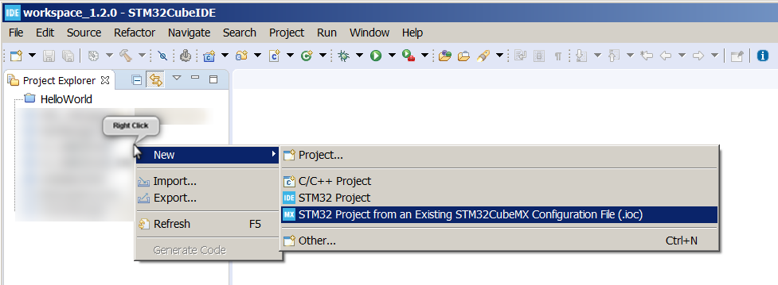

Browse to **HelloWorld.ioc** from the last project, click **Open**.


On the STM32 project setup menu, enter a new project name and click **Finish**.

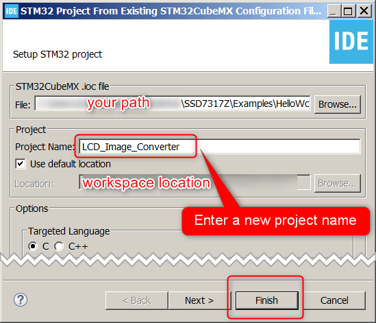

After project creation, STM32CubeIDE will show you the **Pinout view** with the screen capture below.

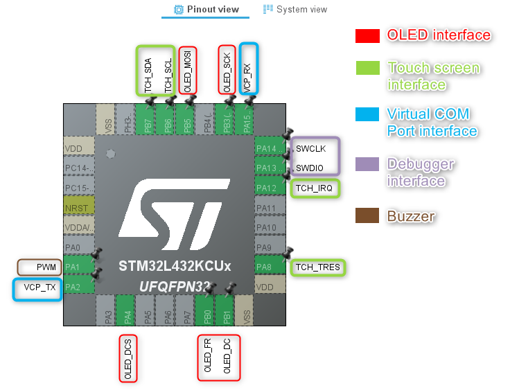

Pinout summary is described in the table below.

| MCU Pinout                                                   | Function                                                    | Interrupt                                       | DMA (Direct Memory Access)                                   | Note                                                         |
| ------------------------------------------------------------ | ----------------------------------------------------------- | ----------------------------------------------- | ------------------------------------------------------------ | ------------------------------------------------------------ |
| PB5(OLED_MOSI)<br/>PB3(OLED_SCK)<br/>PA4(OLED_DCS)<br/>PB1(OLED_DC) | SPI interface for OLED display                              | No                                              | Optional.<br/>Set to DMA1 channel3 with preemption priority level 6 if enabled | **(1)** DMA transfer is not mandatory.<br/>**(2)** Data transfer by DMA will not increase the SPI clock speed. However, using DMA can enhance system performance when there are concurrent tasks.<br/>**(3)** Need to override `DMA1_Channel3_IRQHandler()` in **stm32l4xx_it.c** if DMA is enabled. |
| PB0(OLED_FR)                                                 | GPIO interface for FR output of OLED                        | Yes.<br/>EXTI line0 interrupt enabled for PB0   | No                                                           | **(1)** External interrupt mode with rising edge detected for an FR pulse that is generated by the OLED to indicate blanking periods.<br/>**(2)** Need to override `EXTI0_IRQHandler()` in **stm32l4xx_it.c** |
| PB7(TCH_SDA)<br/>PB6(TCH_SCL)<br/>                           | I2C interface for touch screen                              | No                                              | No                                                           |                                                              |
| PA12(TCH_IRQ)                                                | GPIO interface for IRQ output of touch screen               | Yes.<br/>EXTI line12 interrupt enabled for PA12 | No                                                           | **(1)** External interrupt mode with falling edge detected for IRQ touch event generated by the touch screen.<br/>**(2)** Need to override `EXTI15_10_IRQHandler()` in **stm32l4xx_it.c** |
| PA8(TCH_TRES)                                                | GPIO interface to reset the touch screen                    | No                                              | No                                                           |                                                              |
| PA2(VCP_TX)<br/>PA15(VCP_RX)                                 | Virtual COM Port interface for serial communication with PC | Yes<br/>USART2 global interrupt enabled         | Yes<br/>DMA1 channel6 enabled                                | **(1)** Asynchronous USART mode enabled with DMA for transmitting and receiving debugger messages in the background through serial terminal (115200-8-n-1)<br/>**(2)** Need to override `DMA1_Channel6_IRQHandler()` and `USART2_IRQHandler()` in **stm32l4xx_it.c** |
| PA14(SWCLK)<br/>PA13(SWDIO)                                  | 2-wire ST-LINK debugger interface                           | No                                              | No                                                           | This is enabled by default in STM32CubeIDE                   |
| PA1(PWM)                                                     | Timer2 channel 2 PWM output for buzzer                      | No                                              | No                                                           |                                                              |

One good thing with importing an existing configuration file (*.ioc) is that, **all hardware-specific initializations have been automatically generated for you**. There is no coding required to get an error-free program.

Now, copy the files **ArialBlack_36h.h** and **battery-status-full.h** that we have generated from the last section (Hello World) to the new project. Under Windows environment, expand **Core > Inc**, select the files, and drag-and-drop to the **Inc** directory in **Project Explorer**. You will be asked for the options to **Copy files** or **Link to files**. My personal preference is to copy files because I want to keep project-specific files in each project. 

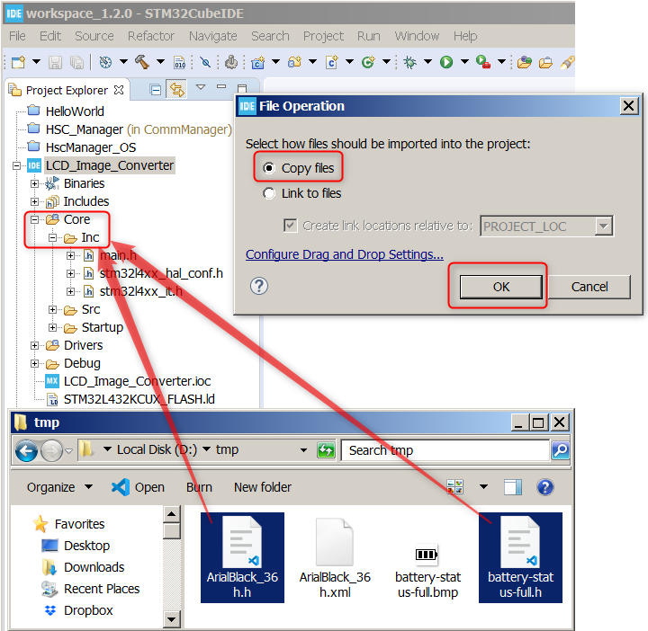

Expand the **Src** folder, open **main.c** and add the following codes inside *USER CODE BEGIN Includes* and *USER CODE END Includes* markers:

```C
/* USER CODE BEGIN Includes */
#include "SSD7317.h"
#include "ArialBlack_36h.h"
#include "battery-status-full.h"
/* USER CODE END Includes */
```

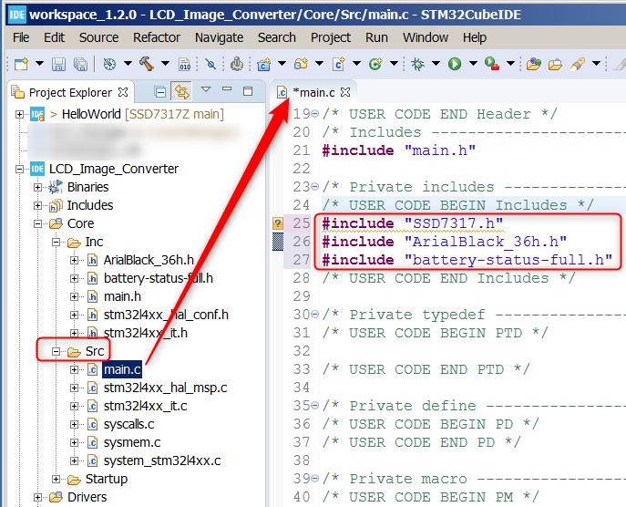

> **NOTE:** All user code that does not go inside *USER CODE BEGIN xxx* and *USER CODE END xxx* markers will be removed on the next Code Generation if there is any change in the Device Configuration Tool.

There is a zip-zap orange underline on `#include "SSD7317.h"` because its file location cannot be resolved yet. We need to let the IDE know where to find the SSD7317 directory. This is the same procedure to set two variables: **Path Variables** and **Build Variables** as that described in [setup](#download-and-build-the-hello-world-project) of Hello World. 

Summary of the procedures are described here:

* Right click on **LCD_Image_Converter** project name > **Properties**
* Expand **Resource > Linked Resources > Path Variables Tab**, click **New** button
* Enter **SSD7317Z** as the name on the menu, click on **Folder** button > browse to \SSD7317Z\Drivers folder > click **Select Folder** button.

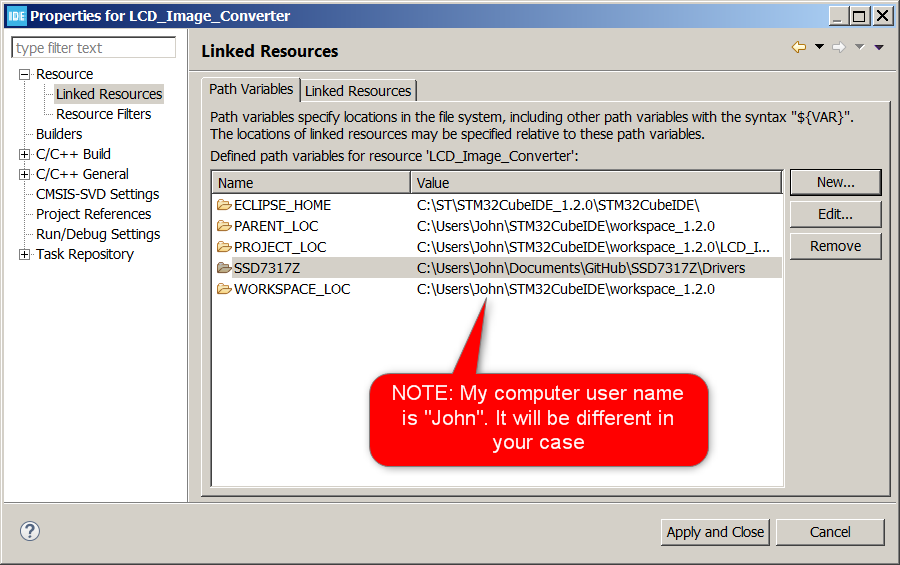

* Expand **C/C++ Build > Build Variables**, click **Add** button

* Under **Debug** configuration, enter **SSD7317Z** as the Variable name, set type as **Directory**, and browse to \SSD7317Z\Drivers folder

* Repeat the same procedures for **Release** configuration. Click **Apply and Close** to make new paths effective.

  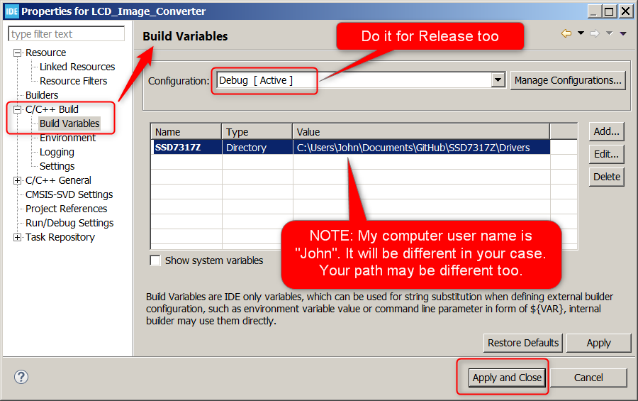

* Re-open the **Properties** dialog box, expand **C/C++ General > Paths and Symbols > Includes** tab, set **${SSD7317Z}/Inc** as a new include directory. Do it for Debug and Release configurations.


* Finally, select the **Source Location** tab and click **Link Folder...** button.

  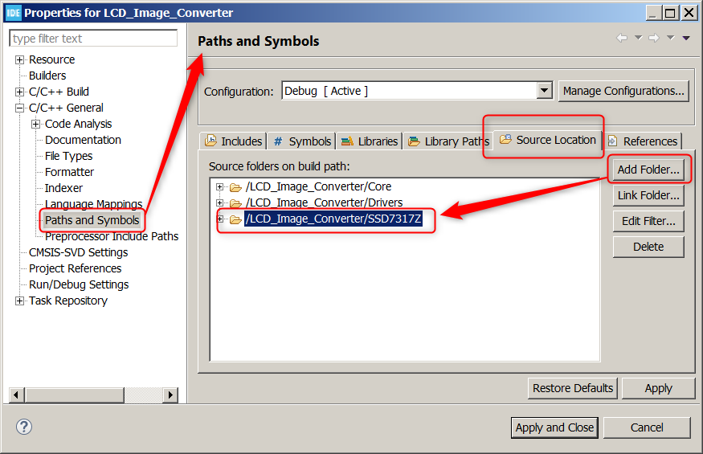
  
  In the **New Folder** dialog box, check **Link to folder in the file system**  checkbox, click **Variables...** button to open the Path Variable selection dialog box, click **SSD7317Z**  to highlight it from the list and click **OK** twice to return to the **Source Location** tab.
  
  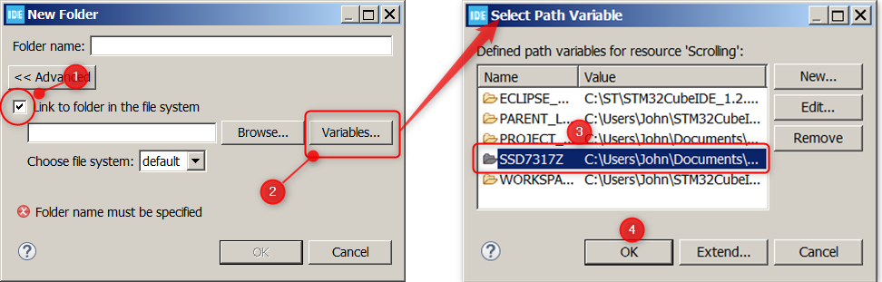
  
  A new source folder **./LCD_Image_Converter/SSD7317Z** is now available. Click **Apply and Close**.
  
  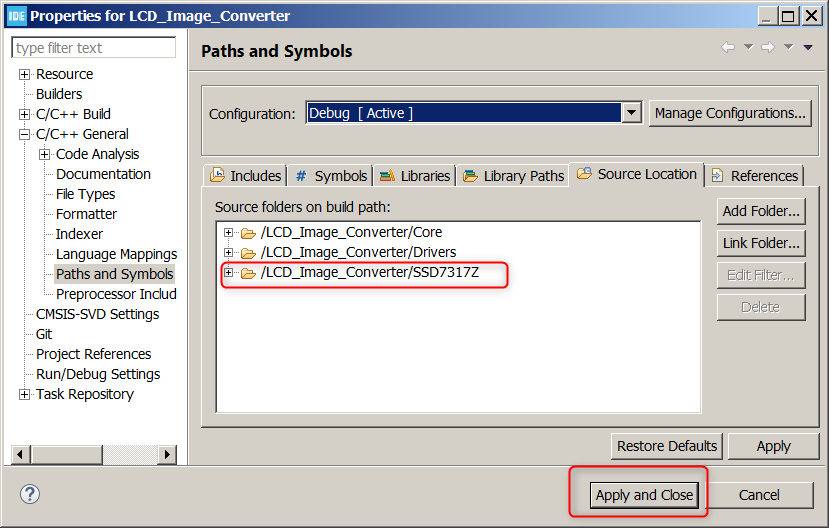

The path for SSD7317Z should be resolved now. Add the following codes to `int main(void)` inside *USER CODE BEGIN x* and *USER CODE END x* markers.

```c
int main(void){
    HAL_Init();
  //MX_GPIO_Init();
  //MX_DMA_Init();
  //MX_USART2_UART_Init();
  //MX_I2C1_Init();
  //MX_SPI1_Init();
  //MX_TIM2_Init();
    SystemClock_Config();
    /* USER CODE BEGIN 2 */
    ssd7317_init();	//1

    ssd7317_put_image(72,0,&batterystatusfull,0); //2
    ssd7317_put_char(0, 80, &ArialBlack_36h, 0x2ee4, 0); //3
    ssd7317_put_char(40,80, &ArialBlack_36h, 0x3296, 1); //4
    /* USER CODE END 2 */
    
    /* USER CODE BEGIN WHILE */
  	uint16_t counter = 0;
  	char str[5];
    while(1){
        /* USER CODE END WHILE */
        /* USER CODE BEGIN 3 */
      	snprintf(str, 5, "%d", counter); //5
	  if(counter++ > 9999)
	  {
		  counter = 0;
	  }
	  HAL_Delay(50);
	  ssd7317_put_string(0,26,&ArialBlack_36h,str,0); //6
    }
    /* USER CODE END 3 */
}
```

From the main menu, **Run > Debug**. Click **Resume (F8)** to run the program. You will see a small battery icon at the top right with two interesting characters  &  in the lower part of the screen. In the middle part, you will see a counting number for the variable `counter` from 0 to 9999. Try changing the value of `HAL_Delay(50)`, say to `HAL_Delay(1)` to see the difference.

### How It Works

Comment all MX_ codes that are automatically generated by STM32CubeIDE. They have been integrated into `ssd7317_init()` for GPIO, I2C, and SPI initialization. `MX_USART2_UART_Init()` and `MX_TIM2_Init()` are initialization functions for USART2 and Timer2 for serial terminal communication and buzzer. They are not required for this demo.

Line 1	`ssd7317_init()` initializes SSD7317 driver. Place it under SystemClock_Config().

Line 2	`ssd7317_put_image(72,0,&batterystatusfull,0)` displays the battery icon at (72,0)

Line 3	`ssd7317_put_char(0, 80, &ArialBlack_36h, 0x2ee4, 0)` displays the unicode 0x2ee4 at (0,80)

Line 4	`ssd7317_put_char(40,80, &ArialBlack_36h, 0x3296, 1)` displays the unicode 0x3296 inverted at (40,80)

Line 5	`snprintf(str, 5, "%d", counter)` converts the integer `counter` to an array `str[5]` that is compatible with the string argument of `ssd7317_put_string(...,const char *str,...)`

Line 6	`ssd7317_put_string(0,26,&ArialBlack_36h,str,0)` displays the counter value as a string at (0,26)

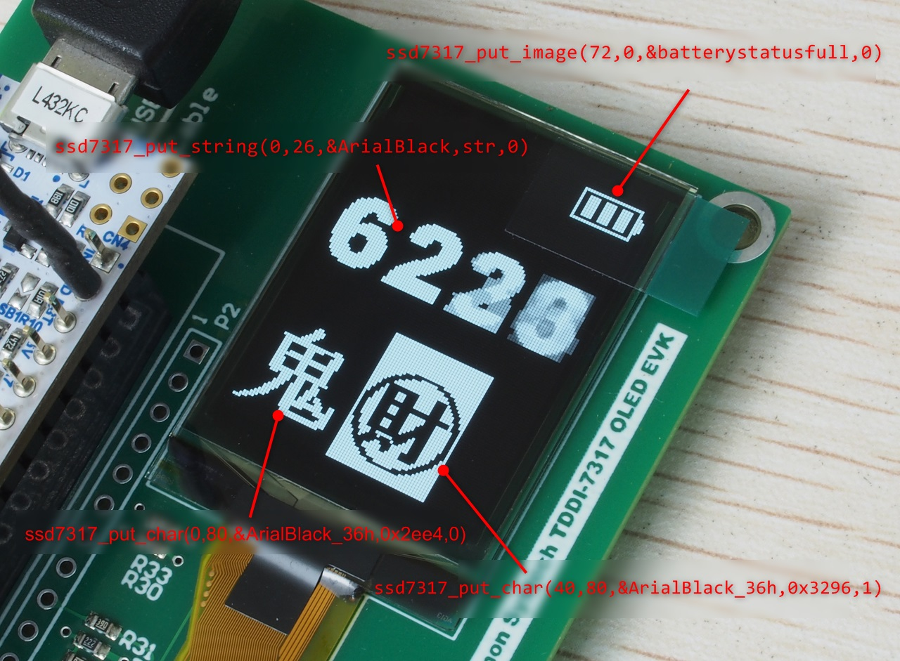


## The Touch Screen and How It Works

Traditional *out-cell*, [OCA](https://en.wikipedia.org/wiki/Liquid_optically_clear_adhesive) bonded or air-gap touch screen stacks up additional layers on top of the LCD module to create a sensing surface for our fingers therefore extra thickness is added to the LCD module as shown in the left figure below. 

Novel *in-cell* touch screen assigns dual functions to SEG and COM layers for display and touch sensing. No extra ITO sensor layer is required. The Top Glass that usually forms the display window of the enclosure is bonded directly to the display (figure below on the right) therefore the total thickness is reduced.

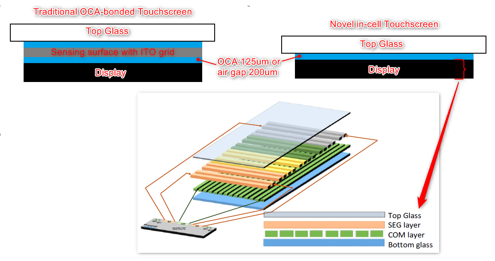

The technique to drive display and touch sensing is called **Time Multiplex Driving Scheme**. In each display period there is a blanking period triggered by a rising FR pulse of 2.4ms (depends on display frame rate) during that period the SEG and COM layers are driven to sense capacitance fluctuation and SSD7317Z will generate a **Touch Report** if the fluctuation exceeds a certain threshold (e.g. with a finger touching the screen). There are two touch sensing modes: **Active Mode** and **Low Power Mode** with the major difference illustrated below.

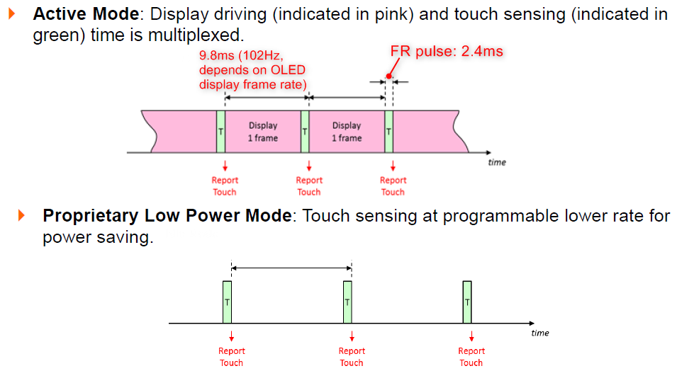

SSD7317Z supports up to 4 *in-cell* touch keys and 4 *out-cell* touch keys and the number of keys is software configurable. On our evaluation board, the mapping is illustrated in the photo below. 

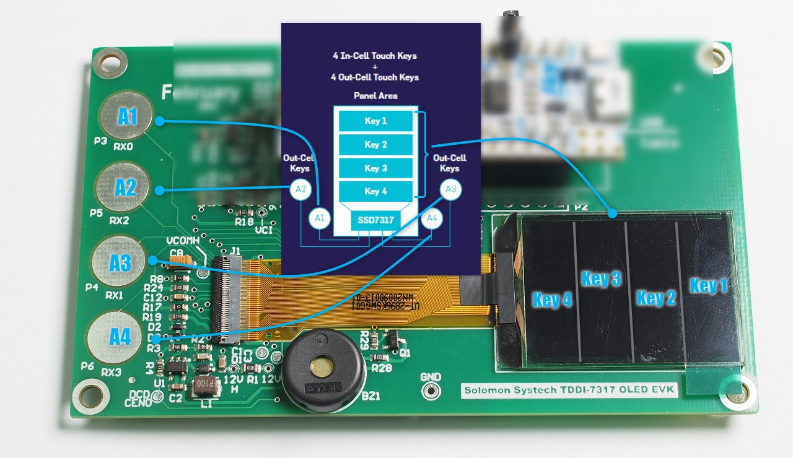

In SSD7317Z there are only two registers to care about for the touch screen: 

1. **S&L** (Status and Length) at register address 0x0AF0

2. **Gesture Upload Data** at register address 0x0AF1

   Status and gesture data stored in these registers form a **Touch Report** that is generated on an FR pulse on a valid touch event. Its format and reading protocol is described in the following section.

### Hardware Interface for Touch Screen
The way to drive the touch screen of SSD7317Z is not much different from the traditional *out-cell* touch. We still have to use I2C to read/write commands and assign GPIO for hardware reset and interrupt detection (refer to gray wirings of the interface diagram below). 


### Procedures to Initialize the Touch Screen
**1.** Initialization starts with `MX_GPIO_Init()`. Next to setting up OLED_FR and OLED_DC for the display part, pinouts for TCH_TRES (output push-pull for hardware reset) and TCH_IRQ (external interrupt with falling edge trigger detection) are configured for the touch screen.

**2.** The second step is to initialize I2C with `MX_I2C1_Init()` which is automatically generated by STM32CubeIDE. You may go back to the **HelloWorld** project, open **HelloWorld.ioc** and expand **Pinout & Configuration > Connectivity > I2C1** to inspect its parameter settings. No DMA or Interrupt (NVIC) setting is required. 

**3.** The next step is to initialize SSD7317Z with a *magic* command sequence delivered by the manufacturer (Solomon Systech). It is stored in the static table `const uint8_t SSD7317_INIT_TBL[]` in `SSD7317.c` with an excerpt of the listing shown below. The upper part of `SSD7317_INIT_TBL[]` initializes parameters for the display part and that for touch screen starts with a command `0x31`:

```c
static const uint8_t SSD7317_INIT_TBL[]=
{
    0xfd,	//enter command lock/unlock
    0xae,	//display off (sleep mode)
    
    /* ...parameters for display part omitted for simplicity */
    
    	0x31,	//initialization sequence for touch module
	0xd0,
	0x34,
	0x0f,
	0x37,
	0x01,
	0x36,
	0x0f,
	0x35,
#ifdef USE_TOUCH_SA_SET_A //option A with #define USE_TOUCH_SA_SET_A in SSD7317.h
	0x0a,
#else
	0x0b,
#endif
}
```
There are programmable I2C map addresses in SSD7317Z for touch screen: TOUCH_SA and TOUCH_SA_BIOS with _SA to indicate a slave address.

* TOUCH_SA=0X53 and TOUCH_SA_BIOS=0x57 when the register `0x35` is set to `0x0a`

* TOUCH_SA=0x5B and TOUCH_SA_BIOS=0x5F when the register `0x35` is set to `0x0b`

Compile-time directive `USE_TOUCH_SA_SET_A` in `SSD7317_INIT_TBL[]` is to control which option is applied. If there is no I2C address conflict with option A in your system, leaving `#define USE_TOUCH_SA_SET_A ` in **SSD7317.h** is fine. 

**4.** Drive TRES pin low for > 10us to reset the touch screen.

**5.** Firmware download to 3 memory blocks (slave address at TOUCH_SA_BIOS) of SSD7317Z: PM (12Kbytes), TM(2Kbytes), and DM(2Kbytes) to configure the number of *in-cell* and *out-cell* keys with contents delivered by Solomon Systech. There are follow-up procedures including checksum assertion, MCU un-stall (means to pass control to MCU), and interrupt event clear which are all encapsulated in the function `touch_init()`.

The pseudo-code of the initialization sequence for the touch screen is listed below as a summary.

```c
/* Pseudo code of ssd7317_init() with focus on touch screen */
void ssd7317_init(void){

    /* initialization of the display part omitted for simplicity */
    
    gpio_init();//GPIO initialization for TRES (reset) and IRQ (interrupt detection)
    i2c_init(); //I2C initialization
    spi_write_command((const uint8_t*)SSD7317_INIT_TBL, byte_count); //Send command table
    TRES_PIN_high_low_high(); //TRES pin driven low for >10us to reset the hardware
    firmware_download(); //Firmware download to PM, TM, and DM memory blocks with touch_init()
}
```

Interested readers may read the full source code of `ssd7317_init()` from ../SSD7317Z/Drivers/SSD7317.c in this repository.

### Reading Touch Report

The HAL-level I2C read/write operations for SSD7317Z are illustrated with packet diagrams with correlations to their read/write functions below.

**I2C write**

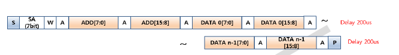

```c
/**
 * @brief
 * \b	Description:<br>
 * 	I2C Write with commands and addresses in 16-bit width.<br>
 * 	Byte order: lower byte send first e.g. reg[7:0] follow by reg[15:8].<br>
 * @param slave is the 7-bit slave address
 * @param reg is the register address sending with LSB first i.e. 0xf0 sent first with reg=0x0af0
 * @param *data points to the data buffer to send
 * @param len is the byte count to send
 */
static void i2c_write(uint8_t slave, uint16_t reg, const uint8_t *data, uint16_t len)
{
    if(len){
		//swap high and low bytes so that lower byte is sent first for ADD[7:0] follow by ADD[15:8]
		uint16_t reg_byte_swap = ((reg<<8)&0xff00) | ((reg>>8)&0x00ff);
        //HAL_ is the hardware-dependent function to I2C write
		HAL_I2C_Mem_Write(&hi2c1, slave<<1, reg_byte_swap, 2, (uint8_t *)data, len, 5000);
	}
	else
	{
        //HAL_ is the hardware-dependent function to write to reg with no parameter
		HAL_I2C_Master_Transmit(&hi2c1, slave<<1, (uint8_t *)&reg, 2, 500);
	}
}
```

> **NOTE:** Although it is stated on the datasheet that a 200us delay is mandatory between data packets in I2C write, actual experiments show that it is not necessary. However, for i2c_read (see below) a packet delay of 200us is strictly required; otherwise, data integrity is corrupted.

**I2C read**

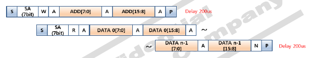

```C
/**
 * @brief
 * \b	Description:<br>
 * 	I2C read from touch controller<br>
 * @param slave is the 7-bit slave address
 * @param reg is the register to read from
 * @param buffer points to an array to keep incoming characters
 * @param len is the byte count to read
 */
static void i2c_read(uint8_t slave, uint16_t reg, uint8_t *buffer, uint16_t len)
{
	HAL_I2C_Master_Transmit(&hi2c1, slave<<1, (uint8_t *)&reg, 2, 500); //This is ADD[15:0] in the diagram
	HAL_DWT_Delay_us(200); //delay for 200us is mandatory for I2C Read
	HAL_I2C_Master_Receive(&hi2c1, (slave<<1)|0x01, buffer, len, 1000); //I2C read for DATA_n[15:0]
}
```

During normal operation (after touch initialization), the **S&L** word (2 bytes) is returned on a valid touch event with the content described in the figure below.

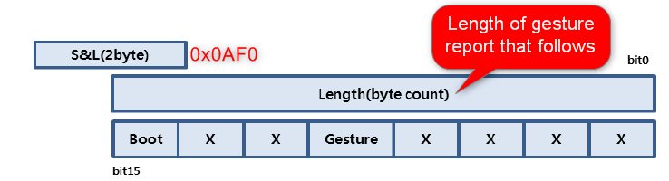

Waveforms for FR, IRQ, and I2C have been captured below to show how exactly **Time Multiplex Driving Scheme** work:


|                           Marker                           | Descriptions                                                 |
| :--------------------------------------------------------: | ------------------------------------------------------------ |
|  | Display period is started by the onset of a sync pulse on the frame synchronization pin (FR)  as the blanking period (2.4ms). |
|  | Touch-sensing driving is triggered by an internal circuitry of SSD7317Z in the blanking period. |
|  | On a valid touch event, an active-low output signal on the IRQ pin is generated by SSD7317Z with touch and gesture informations encapsulated in form of I<sup>2</sup>C messages (Touch Report) waiting for readout. |
|  | The IRQ signal is handled by the MCU as an interrupt source and the MCU starts reading the Touch Report from Slave Address 0x53 (TOUCH_SA) at register 0x0AF0 (**S&L**) |

Correlation with the source code is shown in the code excerpt below:

```C
/* External interrupt callback function for FR and IRQ */
void HAL_GPIO_EXTI_Callback(uint16_t GPIO_Pin) //1
{
	if (GPIO_Pin==OLED_FR_Pin)
	{
		/* FR signal sync for display part omitted for simplicity */
	}
	else if (GPIO_Pin==TCH_IRQ_Pin) //2
	{
		/* Set flag for ssd7317_get_gesture() on a valid touch event. */
		/* Polling ssd7317_get_gesture() is required in non-RTOS environment. */
		touch_event_set(); //3
	}
}

int main(void)){
    HAL_Init();
    SystemClock_Config();
    ssd7317_init();
    /* other USER initializations omitted ...*/
    
    while(1){
        ssd7317_get_gesture(); //4
    }
}

/* API to run in an infinite loop or semaphore if RTOS is implemented */
finger_t ssd7317_get_gesture(void){
	finger_t finger = {0, 0, ACT_ERROR, DETAIL_ERROR};

	if(touch_event_get()){ //5
		uint16_t status;
		/*gesture_upload[0]=Gesture ACT, gesture_upload[1]=Gesture Detail, gesture_upload[2]=KeyNum[6:4]KeyNum[2:0]*/
		uint8_t gesture_upload[6];

		i2c_read(TOUCH_SA, 0x0af0, (uint8_t *)&status, 2); //6
		/*Lower byte of status is the byte count to read from 0x0af1 register*/
		if((status&0xff)>0){ //7
			i2c_read(TOUCH_SA, 0x0af1, (uint8_t *)&gesture_upload, status&0xff); //8
		}
        /*...Code omitted for simplicity */
    }
```

**Explanation**:

**Line 1**	`HAL_GPIO_EXTI_Callback()` is the interrupt callback function sharing the FR signal for frame synchronization and IRQ for a touch event. We need to share the conditional statement `if(GPIO_Pin==OLED_FR_Pin) else ...` because there is only one vector for GPIO interrupt in STM32L432 MCU.

**Line 2**	Condition `GPIO_Pin==TCH_IRQ_Pin` is satisfied on a valid touch event

**Line 3**	`touch_event_set()` to set a global flag `touch_event_flag`

**Line 4**	`ssd7317_get_gesture()` is the API to run in an infinite loop or semaphore if RTOS is implemented.  This function returns a `finger_t` structure that encapsulates gesture action (ACT), details (DETAIL), and key numbers

**Line 5**	Test for a touch event with `touch_event_get()`. If this flag is not set, the function `ssd7317_get_gesture()` returns right away. If there is a valid touch event (`touch_event_set()` in  `HAL_GPIO_EXTI_Callback()`), register at 0x0AF0 (**S&L**) is I2C read in Line 6

**Line 6**	I2C read the register **S&L** at 0x0AF0

**Line 7**	Testing the byte count received. If it is non-zero,  gesture data is available

**Line 8**	This is the real meat by reading the register address at 0x0AF1 for gesture data to `gesture_upload[6]` with its contents described below:

**Gesture Upload Data** at register address 0x0AF1:

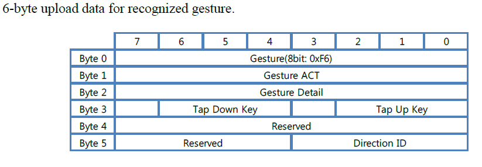

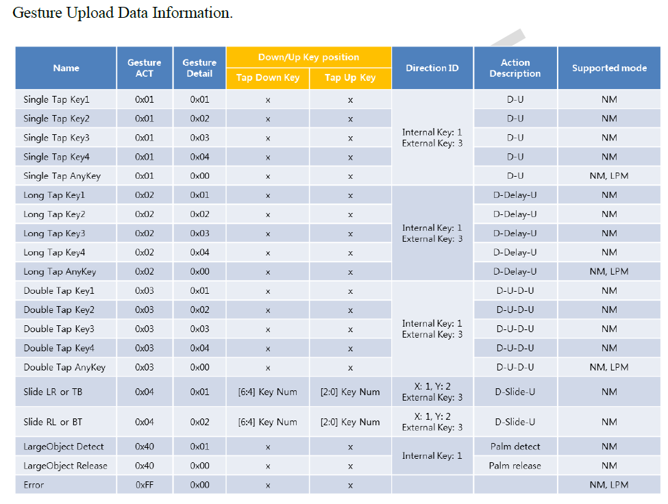

### Running Touch Screen Example

Import the project **Touchscreen** to your IDE workspace by following the same procedures to import [**HelloWorld**](#download-and-build-the-hello-world-project) previously. 

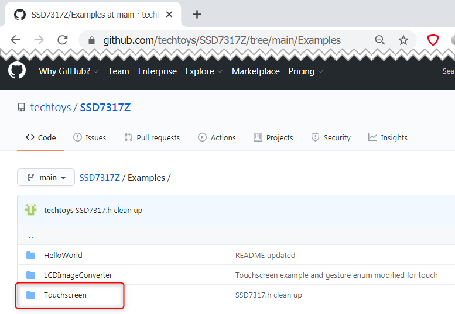

Running the project will show you a GUI similar to the photo below with:

* gesture support for swipe up and down to change the number on the screen

* up arrow for swipe up and down arrow for swipe down shown at the upper left corner

* ski icon as a button with color inverse on a touch event

* long press on any area of the screen to put OLED to sleep

* single click on any area of the screen to wake it up with its screen content restored

* beeping the buzzer on touch event

* monitoring **Gesture Upload Data** at register address 0x0AF1 through a serial terminal

  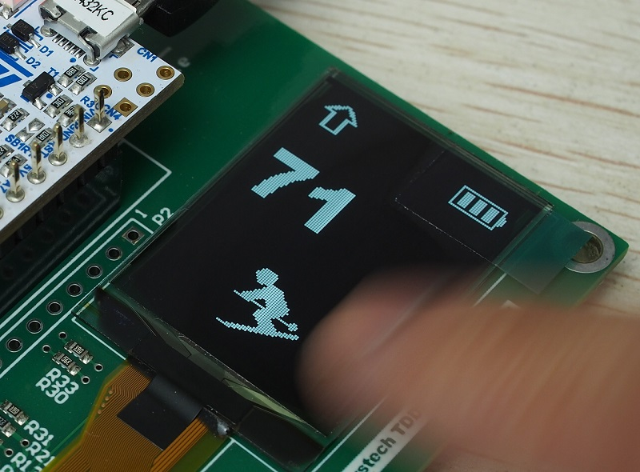

### How It Works

The program starts with including header files described below:

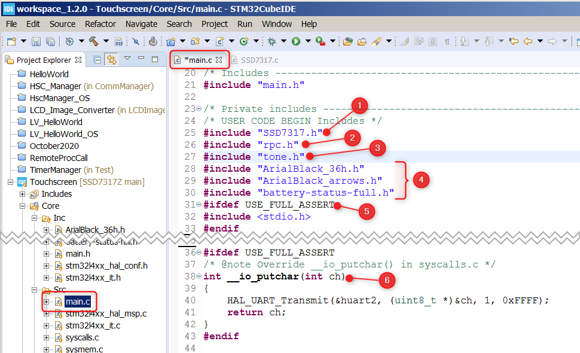

| Marker                                                  | Descriptions                                                 |
| ------------------------------------------------------- | ------------------------------------------------------------ |
|  | Header file for SSD7317. Don't forget to set the **Path Variables** and **Build Variables** with procedures described in the [Hello World](#download-and-build-the-hello-world-project) project to use the driver. |
|  | Header file for Remote Procedure Call (rpc) that allows us to convert serial commands to SPI commands for SSD7317 through a Serial Terminal Program (e.g. [YAT](https://sourceforge.net/projects/y-a-terminal/)). We will also use YAT to monitor the content of the register at 0x0AF1 (Gesture Upload Data) on touch events. |
|  | `tone.h` is a simple PWM generator to drive the buzzer onboard. |
|  | These header files describe the fonts and icons we generated in the last project [LCD Image converter](#lcd-image-converter). |
|  | Project-wise directive in the **# Symbols** tab under **Properties > C/C++ General > Paths and Symbols**. With full assert, we will be able to catch run-time exceptions with `assert_failed((uint8_t *)__FILE__, __LINE__)` through YAT. |
|  | `__io_putchar(int ch)` calls a HAL-level function to divert `printf()` function to UART2. |

Skeleton of the program is described in the listing below:

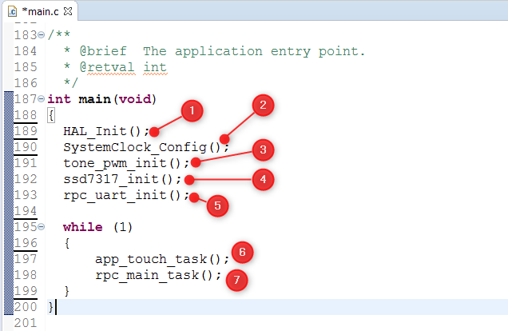

| Marker                                                  | Descriptions                                                 |
| ------------------------------------------------------- | ------------------------------------------------------------ |
|  | Function `HAL_Init()` is automatically generated by STM32CubeIDE to reset all peripherals and initialize the Flash interface of the MCU.  With a HAL_ prefix, it implies the function comes from the hardware abstraction layer (HAL). No coding is required. |
|  | `SystemClock_Config()` is also automatically generated by STM32CubeIDE to initialize the system clock of the MCU. No coding is required. |
|  | This code initializes PA1 as a PWM generator to drive the buzzer onboard. On inspecting its content, you will find that the code is generated by STM32CubeIDE in `MX_TIM2_Init()`. Again, no coding is required. |
|  | `ssd7317_init()` is the initialization function of SSD7317Z. |
|  | `rpc_uart_init()` is the function to initialize the Remote Procedure Call (RPC) module that allows us to input commands from YAT to control the OLED. Combining with the `#USE_FULL_ASSERT` directive, we have a full-duplex communication channel for control and monitoring the program. |
|  | This is the task to listen and respond to touch events that we are describing next. |
|  | `rpc_main_task()` is the task to listen and respond to YAT.  |

Describing `app_touch_task()` with listing below:

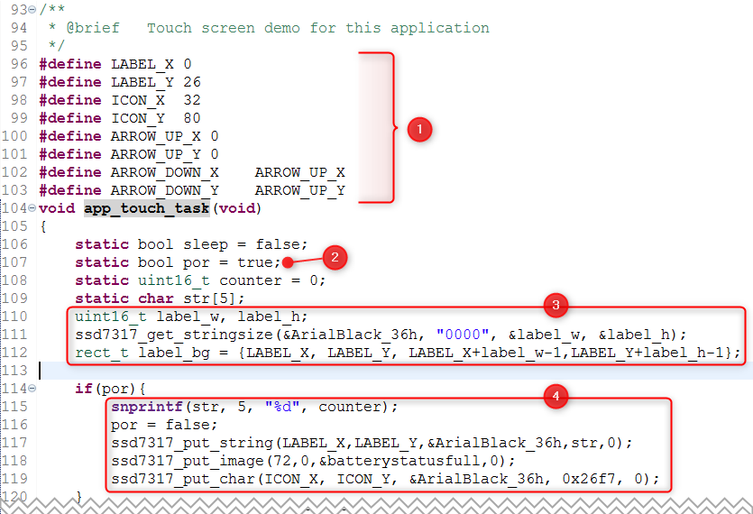

| Marker                                                  | Descriptions                                                 |
| ------------------------------------------------------- | ------------------------------------------------------------ |
|  | Definitions for the positions of graphical contents          |
|  | A protected, global variable `por` to divert the program to draw a startup screen on POR (power-on-reset). |
|  | This section gets the label width for up to 4 digits as the background of the running number. We will use the variable `label_bg` to clear the background of the label before updating a new value. |
|  | Code snippet to run only on POR and it never reaches here until the next system restart. |

After POR, the API to get touch gesture `ssd7317_get_gesture()` is executed:

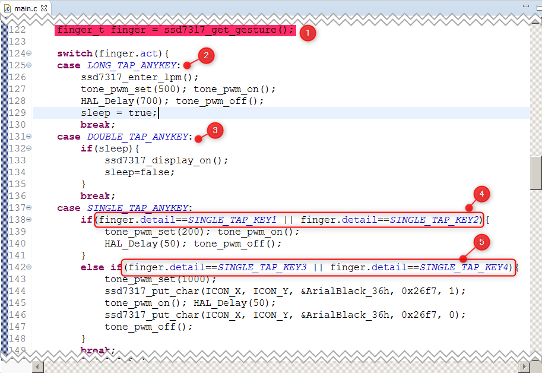

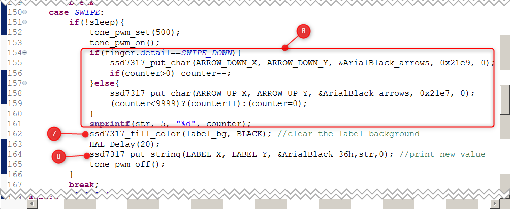


| Marker                                                  | Descriptions                                                 |
| ------------------------------------------------------- | ------------------------------------------------------------ |
|  | Polling `ssd7317_get_gesture()` returns a structure `finger_t` that describes the Tap Down/Up keys, Gesture ACT, and Gesture Detail according to **Gesture Upload Data** register at 0x0AF1. |
|  | It is the case for `LONG_TAP_ANYKEY` to respond to a touch-and-hold action on the touch screen. The OLED enters into a **Low Power Mode** with `ssd7317_enter_lpm()` to switch DCDCENO output low to discharge VCC (12V) and send over the display sleep command (0xAE). **All graphical contents on GDDRAM are preserved in Low Power Mode.** |
|  | With a double click on any area of the screen, the OLED wakes up from the SPI command 0xAF in `ssd7317_display_on()` with the **original graphical contents restored.** |
|  | There are 4 keys on the touch screen with an arrow (upper-left) and a battery icon (upper right) on Key 1 region and the counter (e.g. 71) on Key 2 region. They are non-responsive labels on the GUI so a blunt beep is generated as an alert on tapping.<br/>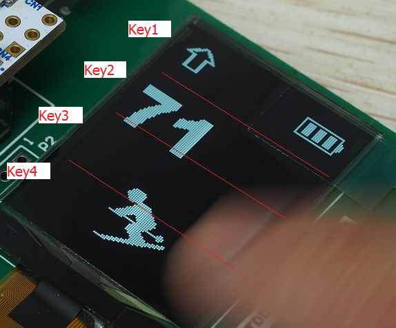 |
|  | If a finger lands on key 3 or 4 regions that the ski icon (character 0x267f) spans, the icon is refreshed with its background inverted (by toggling the last argument of `ssd7317_put_char(args, bool negative)`) together with a sharp beep. |
|  | With a swipe-down gesture, the counter is decremented `(counter--)` with a DOWN arrow displayed `ssd7317_put_char(ARROW_DOWN_X, ARROW_DOWN_Y, &ArialBlack_arrows, 0x21e9, 0)` at the upper-left corner. Similarly with a swipe-up gesture, the counter is incremented and an UP arrow displayed. The integer `counter` is converted to a string by `snprintf()` for printout. |
|  | This code paints the background BLACK by `ssd7317_fill_color(label_bg, BLACK)`. |
|  | This code draws the `counter` as a string by `ssd7317_put_string()`. |
### Demo on YouTube
[](https://youtu.be/SL3LxhRAtbs)

## Infinite Content Scrolling

In the SSD7317Z controller, there are advanced graphic commands that allow the user to scroll the full-frame or a segment of the screen content without having to recopy graphical data from the MCU. The commands are particularly useful for low-resource MCUs that do not have a lot of memory but animations like an icon swipe up and down controlled by different gestures are required. Modes of scrolling supported in SSD7317Z are summarized in the table below.

| Illustration | Graphical effect | Command |
| :------------ | :------: | :------- |
| 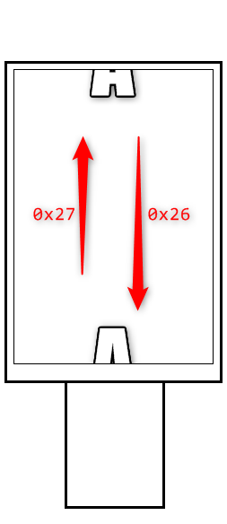 | Continuous vertical scroll up/down with graphical contents wraparound | 0x27 (scroll up)<br/>0x26 (scroll down) |
| 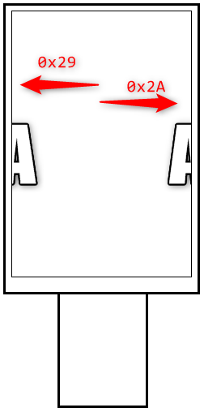 | Continuous horizontal scroll left/right with graphical contents wraparound | 0x29 (scroll left)<br/>0x2A (scroll right) |
| 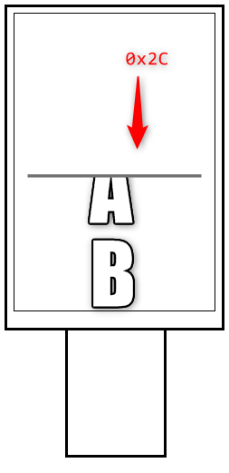 | Content scroll down a pre-defined area with new graphical contents copied to GDDRAM. The illustration at the left box shows the case when character **A** is copied from MCU's FLASH to update GDDRAM with character **B** scrolled down. An effect similar to infinite content scroll beyond the screen area can be achieved. | 0x2C (scroll down) |
| 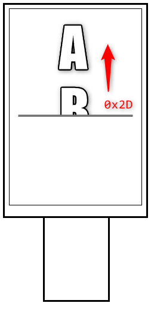 | Content scroll up a pre-defined area with new graphical contents copied to GDDRAM. The illustration at the left box shows the case when character **B** is copied from MCU's FLASH to update GDDRAM with character **A** scrolled up. An effect similar to infinite content scroll beyond the screen area can be achieved. | 0x2D (scroll up) |

There is a second confidential document on **[Advanced Graphic Command](./Docs/SSD7317_APPENDIX_IX.pdf)** to describe in full detail the command format so that I am not repeating it in this repository. Instead, I will correlate the commands with functions in **SSD7317.c**.

### API Functions

Continuous vertical/horizontal scroll (commands 0x27,0x26,0x29, & 0x2A) with `ssd7317_cons_scroll_page(args)`:

```C
/**
 * @brief
 * \b Description:<br>
 * Function to continuously scroll the screen content<br/>
 * This function is valid for COM-page H mode only and the hardware-specific commands 26h/27h/29h/2Ah.
 * @param subpage defines the start page and end page address to scroll
 * @param interval sets time interval between each scroll step in terms of frame frequency from 0-7<br/>
 * 0(6 frames), 1(32 frames), 2(64 frames), 3(128frames), 4(3 frames), 5(4 frames), 6(5 frames), 7(2 frames)
 * @param accelerate is the scrolling offset from 1 row to 95 rows
 * @param dir is the SWIPE direction (SWIPE_UP or SWIPE_DOWN)
 * @note This function comes from a part of the Advanced Graphic Acceleration Command set released by Solomon Systech.<br/>
 * There are eight consecutive bytes to set up the scrolling parameters including start page, end page, start segment, end segment,
 * the command itself and some dummy bytes. There is no frame buffer operation with this function.
 */
void   ssd7317_cons_scroll_page(rect_t subpage, uint8_t interval, uint8_t accelerate, finger_t dir);
```

Content vertical scrolling with commands 0x2C/0x2D to copy data from MCU's FLASH to GDDRAM `ssd7317_cntnt_scroll_image(args)`:

```C
/**
 * @brief
 * \b	Description:<br/>
 * 		Function to scroll an image from FLASH with content scroll command 2Ch/2Dh.<br/>
 * 		This function is valid for COM-page H mode only.
 * @param	left is the top-left position of the image to scroll in pixel, only valid in a multiple of 8.<br/>
 * @param	start_col is the start column(segment), it is also the top segment address in the native orientation of the OLED.
 * @param	end_col is the end column(segment), it is also the bottom segment address.
 * @param 	*image is a pointer to tImage structure.
 * @param	dir is the swipe direction, either SWIPE_UP(SWIPE_RL) or SWIPE_DOWN(SWIPE_LR).
 * @note	end_col should be larger than start_col; else, the function will swap it for you.
 * Scroll direction is controlled by dir.detail==SWIPE_DOWN / SWIPE_UP, not by end_col and start_col pair.
 */
void   ssd7317_cntnt_scroll_image(uint16_t left, int16_t start_col, int16_t end_col, const tImage* image, finger_t dir);
```

### Demo on YouTube
The demo is available from **../SSD7317Z/Examples/ContentScroll** with YouTube video in the link below:
[](https://youtu.be/pduHxkwt60I)

## Porting the Driver to Your MCU
### Porting the HAL (Hardware Abstraction Layer)
Driver for SSD7317Z has been designed with portability in mind. However, there are still hardware-dependent codes you will need to develop. The table below summarizes the files and codes you need to port for your MCU.

| File                                        | Code to port                                                 | Description                                                  |
| ------------------------------------------- | ------------------------------------------------------------ | ------------------------------------------------------------ |
| `Dwt_stm32_delay.h`<br/>`Dwt_stm32_delay.c` | `uint32_t HAL_DWT_Delay_Init(void)`                          | Initialization of software delay in microsecond precision. This function is called only once in `SSD7317.c::touch_init().` |
| `Dwt_stm32_delay.h`                         | `void HAL_DWT_Delay_us(volatile uint32_t microseconds)`      | Software delay in microsecond precision. This function is called only once in `SSD7317.c::i2c_read().` |
| `SSD7317.c`                                 | `void HAL_Delay(uint32_t Delay)`                             | Software delay in millisecond precision.                     |
|                                             | All codes with `HAL_` prefixes include:                     | Codes with `HAL_` prefixes indicate hardware-dependent code generated by **STM32CubeIDE** with HAL being `Hardware Abstraction Layer`. |
|                                             | `HAL_GPIO_EXTI_Callback()`                                   | External interrupt detection callback for <br/>(1) Touch event triggered by a falling edge on `IRQ` pin,<br/>(2) Frame synchronization signal on a rising edge on `FR` pin. |
|                                             | `HAL_GPIO_WritePin()`                                        | GPIO output.                                                 |
|                                             | `HAL_SPI_Transmit()`                                         | SPI transfer in functions:<br/>(1) `ssd7317_put_image_direct()`<br/>(2) `ssd7317_cntnt_scroll_image()`<br/>(3) `spi_write_command()`<br/>(4) `spi_write_data()`<br/>(5) `fb_spi_transfer()` |
|                                             | `HAL_I2C_Mem_Write(..., slave,reg,*data, ...)`               | Write a block of data (`*data`) to a designated memory address at `reg` of slave device `slave`. This function is called only once in `i2c_write()`. |
|                                             | `HAL_I2C_Master_Transmit(..., uint16_t DevAddress, uint8_t *pData, ...)` | Set register address `DevAddress` for read/write operation thereafter in `i2c_read()` and `i2c_write()`. Please refer to a remark below this table for further explanation. |
|                                             | `HAL_I2C_Master_Receive()`                                   | Receives in master mode an amount of data in blocking mode.  |
|                                             | `HAL_StatusTypeDef`                                          | The data type `HAL_StatusTypeDef` is used for error assertion in `SSD7317.c`  to catch low level I/O exception, e.g. `HAL_StatusTypeDef err = HAL_SPI_Transmit()` to catch an error with the variable `err`. If a return handler is not available in your SDK, it is possible to skip it by calling `HAL_SPI_Transmit()` without returning any value. |

**Remark:**

The second argument in the function `i2c_write(uint8_t slave, uint16_t reg, const uint8_t *data, uint16_t len)` sends the register address with the lower byte first followed by the higher byte (byte swap). In STM32, we need two hardware-dependent functions to handle the byte swap and they look very similar. They are 

* `HAL_I2C_Mem_Write()`  & 

* `HAL_I2C_Master_Transmit()`.

A more careful study shows that the data length `len` as the argument for `HAL_I2C_Mem_Write()` should be non-zero; otherwise, an error as ` HAL_I2C_ERROR_INVALID_PARAM ` will return. It leads to a conditional statement to divide it with `len` being zero or non-zero with code snippet as follows:

```C
static void i2c_write(uint8_t slave, uint16_t reg, const uint8_t *data, uint16_t len)
{
	if(len){
		//swap high and low bytes so that lower byte is sent first
		uint16_t reg_byte_swap = ((reg<<8)&0xff00) | ((reg>>8)&0x00ff);
		HAL_I2C_Mem_Write(&hi2c1, slave<<1, reg_byte_swap, 2, (uint8_t *)data, len, 5000);
	}
	else
	{
		//[high:low] bytes of reg are swapped with HAL_I2C_Master_Transmit()
		//i.e. Byte 0x01 is sent first followed by 0x00 when reg=0x0001.
		//Example in i2c_write(TOUCH_SA, 0x0001, 0, 0)
		HAL_I2C_Master_Transmit(&hi2c1, slave<<1, (uint8_t *)&reg, 2, 500);
	}
}
```

The I2C waveform below may help you to visualize the data format required.

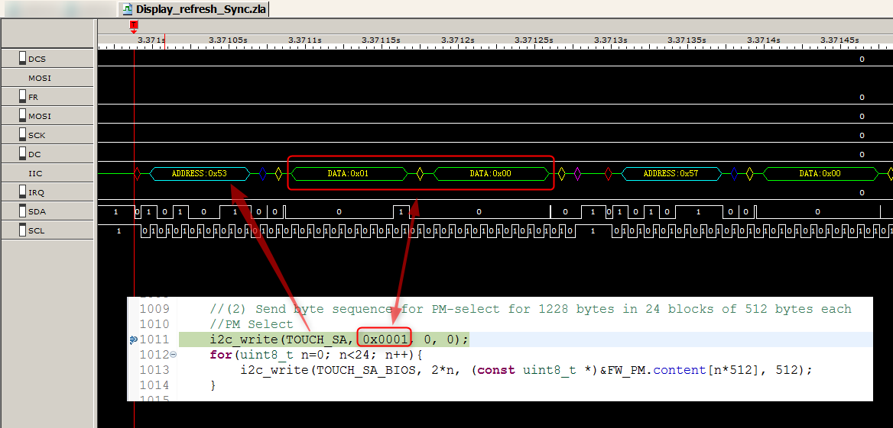

---

| File        | Code to port                           | Description                                                  |
| ----------- | -------------------------------------- | ------------------------------------------------------------ |
| `SSD7317.c` | All codes with `MX_` prefixes include: | Codes with `MX_` prefixes indicate hardware-dependent code generated by **STM32CubeIDE**. |
|             | `MX_GPIO_Init()`                       | Initialization of GPIO for `DC` pin, `FR` pin, `TRES` pin and `IRQ` pin. |
|             | `MX_SPI1_Init()`                       | Initialization of SPI module for display.                    |
|             | `MX_I2C1_Init()`                       | Initialization of I2C module for touchscreen.                |

### Which Code to Get Started?

After porting all of the `HAL_*` and `MX_*` functions, I would suggest starting with the function `void ssd7317_put_image_direct(uint16_t left, int16_t top, const tImage* image)` to draw an image without going through the frame buffer.  No `FR` synchronization is involved either. This function simply copies pixels from MCU's FLASH to GDDRAM of the OLED to get an image displayed. The procedure of image conversion has been fully described in the section [LCD Image Converter](#lcd-image-converter) above. 

**Thank you!**

