# SSD7317Z
is a controller IC designed by [Solomon Systech Ltd.](https://www.solomon-systech.com/) with touch screen and display controller circuits fabricated on the same die. Photo below shows a conventional *out-cell* screen with separated touch screen and LCD module on the left versus the *in-cell* screen with a single Touch and Display Driver Integration (TDDI) IC driver on the right.


Out-cell solution uses a highly conductive and optically transparent Indium Tin Oxide (ITO) printed as grids on a substrate to sense our finger for changes in capacitance. The substrate is bonded to the top glass of the LCD module by some optically clear adhesive [OCA](https://en.wikipedia.org/wiki/Liquid_optically_clear_adhesive). A major advantage of an out-cell is flexibility: engineers have the freedom to mix different types of touch screen with a LCD module for different designs. Disadvantages include a larger thickness and weight because the touch substrate is a separate layer that needs OCA to bond it to the top of the LCD module. Additional manufacturing processes also lead to longer production time, more complex quality assurance, higher production cost and yield risks.

Novel in-cell solution eliminates the touch and OCA layers altogether. Because there is no external substrate carrying the ITO sensing grids, it turns out a thinner display with better light transmittance can be made. Figure below highlights the structural difference between an out-cell and the in-cell.


The question is: how capacitive sensing is performed without an ITO layer? The silicon designer came up with an answer to assign dual functions to the SEG and COM electrodes - for display driving and touch-sense driving. A Time Multiplex Driving Scheme is used to divide display driving and touch sensing period in each frame as shown below.


|                           Marker                           | Description                                                  |
| :--------------------------------------------------------: | ------------------------------------------------------------ |
|  | Display period is started by the onset of a sync pulse on the frame synchronization pin (FR)  as the blanking period (2.7ms) |
|  | Touch-sense driving is triggered by internal circuitry of SSD7317Z in the blanking period |
|  | On a valid touch event, an active-low output signal on the IRQ pin is generated by SSD7317Z with touch and gesture informations encapsulated in form of I<sup>2</sup>C messages (touch report) waiting for readout |
|  | The IRQ signal is handled by the MCU as an interrupt source and the MCU starts reading the touch report |

As yet, do not worry too much on the inner workings and how the waveforms were captured such as why the first I<sup>2</sup>C frame is 0x53 0xF0 0x0A, etc. They will be fully described in following sections with full details (setup, source code, and protocol of the touch report.)

## Our First PMOLED TDDI Display Module - UT2896KSWGG01

is a passive matrix monochrome OLED display of 96*128 with 4 in-cell touch keys, 1-D slide gesture detect and 4 outside keys fabricated by [WiseChip Semiconductor Inc.](https://www.wisechip.com.tw/en/) This repository describes how the novel in-cell display module is interfaced to a popular STM32 M4 MCU and the display and touch drivers developed.


## Hardware Interface to PMOLED Module

Two interface types are required to drive the PMOLED module: SPI for display and I2C for touch screen. There are also GPIOs required for interrupts for FR (frame synchronization) and IRQ (touch event).

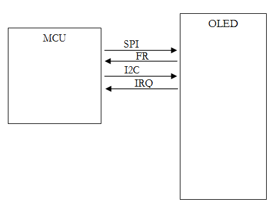

## An Evaluation Board

To facilitate the tasks of testing and development, we have designed an evaluation board with the following features:

1. Compatible pin headers for a low-cost and standard evaluation kit of ST MCU [STM32L432KC](https://www.st.com/en/microcontrollers-microprocessors/stm32l432kc.html)
2. Onboard 12V DC-DC generator of Texas Instruments [TPS61040](https://www.ti.com/product/TPS61040) for VCC of the PMOLED module
3. Adjustable LDO [AP2127K-ADJTRG1](https://www.mouser.hk/ProductDetail/Diodes-Incorporated/AP2127K-ADJTRG1/?qs=x6A8l6qLYDB9dJkf7MndUg==) for VCI and VDD so that you may change the voltage output to fit your application processor, just in case it is different from 3.3V
4. Buzzer with a simple NPN driving circuit for audio feedback
5. Test points across major power rails (VCC, VCI, VDD) for measurement on current ratings

The full schematic of the evaluation board is found from this repository at this [link.](./Schematics/UT-2896KSWGG01-WiseChip-EVK-Sch.pdf)

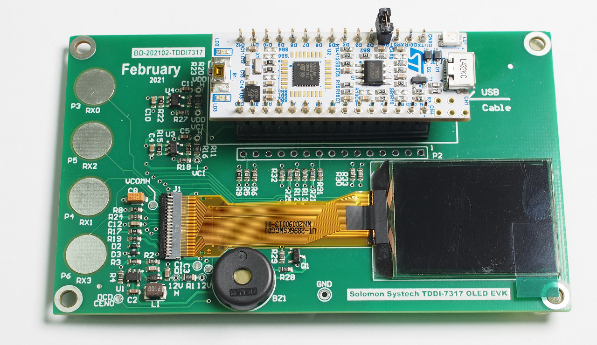

## Setting Up the Integrated Development Environment (IDE)

STM32CubeIDE is an all-in-one development tool released by STMicroelectronics. It is available for 3 operation systems: Linux (Debian, Generic, RPM), macOS, and Windows. Full details on the system requirements and installer packages are available from the hyperlink below:

https://www.st.com/en/development-tools/stm32cubeide.html#get-software

At time of writing the latest version of STM32CubeIDE was 1.5.1. I am using an old version 1.2.0 with updates but it should be compatible with the latest version. In this repository, all examples have been compiled, linked and tested with no error with the host PC running 64-bit Windows 7 and Windows 10, and all programs are confirmed to run on the evaluation board.

In my environment the installation path is set to **C:\ST\STM32CubeIDE_1.2.0** by following the default option. However, you may use any path you find it convenient. In the installation procedures, you will be asked whether to install the SEGGER J-Link drivers, ST_LINK drivers, and ST-LINK server. Check ST_LINK drivers and ST-LINK server with SEGGER J-Link drivers optional. After installation, a desktop shortcut is created.


The STM32CubeIDE is based on [Eclipse](https://en.wikipedia.org/wiki/Eclipse_(software)) that uses a directory called *workspace* to store its preferences and configurations. Every time you run STM32CubeIDE, you will see a dialog box similar to the screen capture below to ask you for the workspace location. In my case, I just follow the recommended path at **C:\Users\John\STM32CubeIDE\workspace_1.2.0** with *John* as my computer user name. It is not mandatory to set the workspace in C drive. You may use other directory at your convenience. From now on, I will refer your installation path as *<your path>*.


Installation of STM32CubeIDE is a straightforward procedure. If you happen to have an issue, the [ST community](https://community.st.com/s/topic/0TO0X000000y2j7WAA/stm32cubeide) is a good place to ask for assistance.

## Download and Build the Hello World Project

Full source code is available from GitHub at https://github.com/techtoys/SSD7317Z. By expanding the button followed by **Download ZIP**, you will get a compressed file "**SSD7317Z-main.zip**".

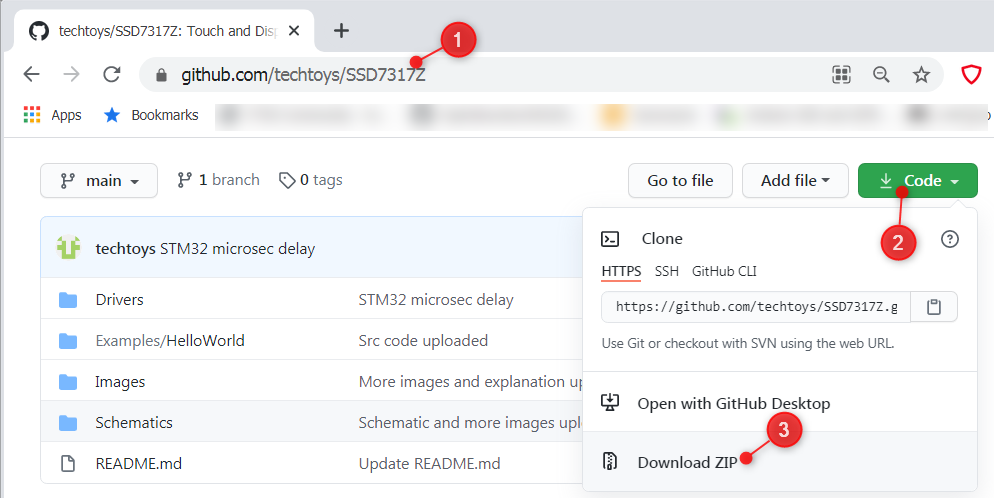

Unzip the file to any location you like.

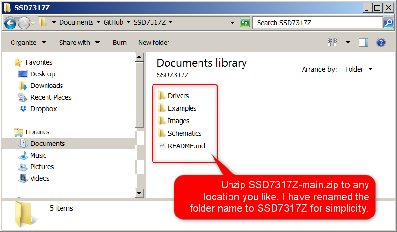

Return to STM32CubeIDE, right click on **Project Explorer > Import > General > Existing Projects into Workspace > Next**. From the Import Wizard, click **Browse**  to select the root directory of **HelloWorld** . The project path will be automatically resolved. Click **Finish**  to confirm.

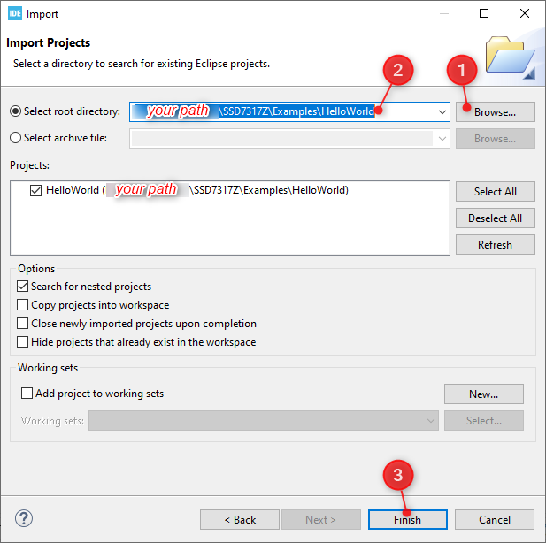

You will see **HelloWorld** under **Project Explorer**. Everything seems fine except there is a yellow exclamation mark on the folder icon of SSD7317Z that means STM32CubeIDE has failed to resolve its location. It is because the device driver of SSD7317Z is located outside of the HelloWorld project as a shared library. Its relative path was set correctly in my PC but it is not set in your environment yet.

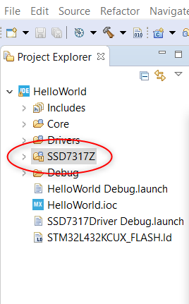

To fix the issue, you need to set two variables: **Path Variables** and **Build Variables**. Right click on the project title, from the pop-up menu click on **Properties**.

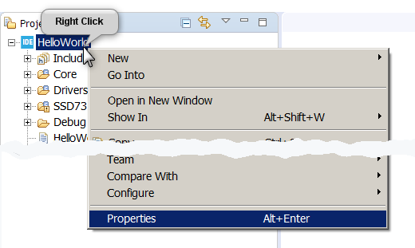

Expand **Resource > Linked Resources > Path Variables**. Highlight on **SSD7317Z** and click on the **Edit** button to point the path variable of SSD7317Z to the *\Drivers* folder that is the root containing the header *\Inc* and source *\Src* folders of SSD7317Z.

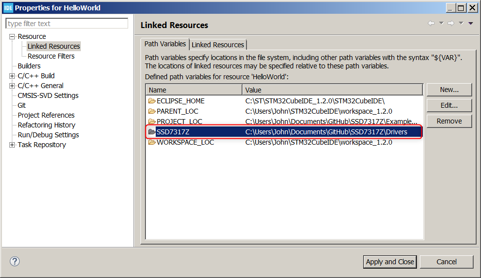

Next, expand **C/C++ Build** > **Build Variables** > set SSD7317Z directory to *\Drivers* folder for Debug and Release configurations. Close by clicking the **Apply and Close** button. You will see the exclamation mark is now resolved to an arrow indicating a relative path.

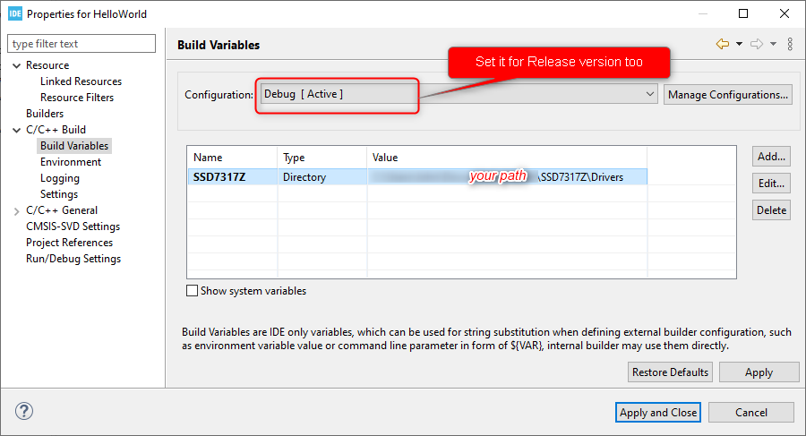

Now you have successfully configured the IDE. The last step is to build the project by clicking on **Project > Build All** from the IDE's menu bar. Make sure there is no error and observe that HelloWorld.elf and .bin files are built correctly that are required for debug and standalone operations.

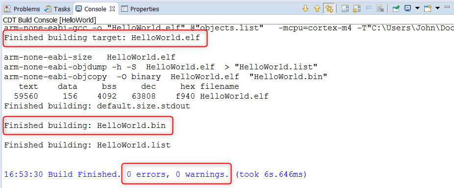

To run the project on hardware, connect the MicroUSB port of NUCLEO STM32L432KC to your PC. On the first-time connection you may be asked to upgrade the ST Link firmware and it is no harm to do it.

Click on **Run > Debug** or **F11**, or click on the ladybug icon followed by running the project with **Run > Resume** or **F8**.

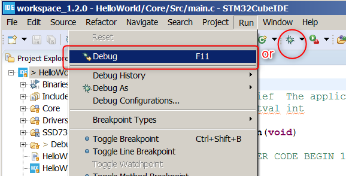

In 1-2 seconds you will see the PMOLED show **Hello World** on it.


## How It Works

To understand how **HelloWorld** work, we have to know more about the memory layout of SSD7317Z. There is a memory region known as the **Graphic Display Data RAM (GDDRAM)** physically mapped to each pixel in an one-bit depth on the screen.

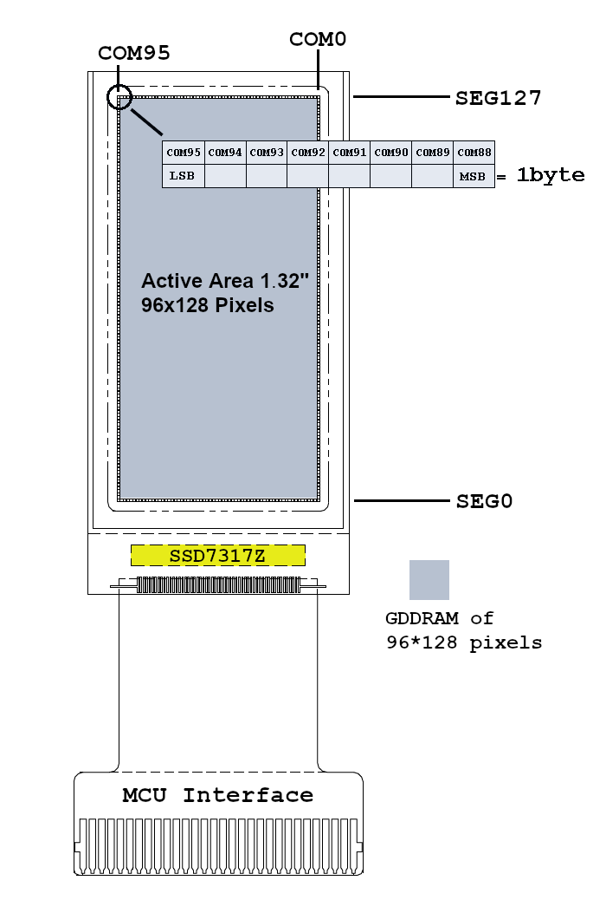

Each pixel is placed at the intersection of a particular row and column addressing lines denoted by SEG (short for segment) and COM (short for common) respectively. The full size of GDDRAM is 1,536 bytes arranged in an array of 12x8x128 bits. The COM lines span from 95 to 0 for 96 dots (12x8 dots) in the horizontal direction and SEG lines from 127 to 0 for 128 dots in vertical direction with mapping configured by a particular set of parameters (initialization parameters) which are written to SSD7317Z on startup.

How pixels are rendered down to the COM and SEG addressing scheme is a complex and specialized topic. Fortunately, unless it was our task to design another display driver IC like SSD7317Z, there is no need for us to bother how pixels are scanned and driven inside the module. Instead, we just need to focus on how data is written and stored in GDDRAM from an external perspective. Once a data array is stored in GDDRAM, internal circuitry of SSD7317Z will automatically scan and refresh the screen.

Wiring diagram between Nucleo L432KC and PMOLED for the display part is shown below.

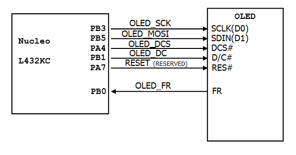

We need at least four wires (4-wire SPI) to drive the PMOLED. They are 

- OLED_SCK (serial clock)

- OLED_MOSI (master out slave in)

- OLED_DCS (chip select)

- OLED_DC (data/command selection)

There is no MISO (master in slave out) required because the PMOLED is a unidirectional device - SPI data flow from the master (MCU) to slave (PMOLED) only, i.e., it is a half duplex device. 

Allocation of PA7 as the reset pin is optional because it is required only in system startup but we still can afford it since there are spared pins available. If there is a need to save MCU pins for future designs, it is possible to use a dedicated reset IC (e.g. STM6321) for the same function. On the evaluation board, that function is performed by a simple RC circuit.

**SPI Data Transfer**

Figure below shows the SPI timing diagram. Data transmission occurs on the rising edge of the serial clock (SPI_SCK) with most significant bit (MSB) first. The signal DC (D/C#) controls whether the byte is a command (DC=0) or data (DC=1). 

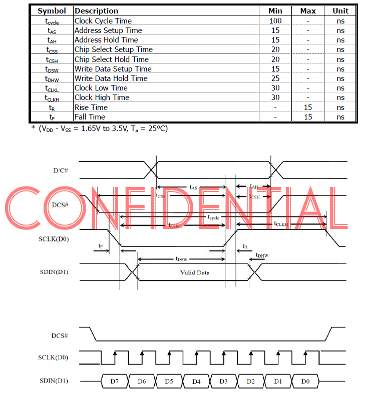

Correlation between the timing diagram and the source code is found in the function `SSD7317.c :: MX_SPI1_Init(void)`, which is a function to initialize the SPI module of the MCU (STM32L432KC). Listing of `MX_SPI1_Init(void)` is shown below for reference.
```c
/* SPI1 Initialization Function. Direct copy from STM32CubeIDE Code Generation utility.*/
static void MX_SPI1_Init(void)
{
	/* SPI1 parameter configuration*/
	hspi1.Instance = SPI1;
	hspi1.Init.Mode = SPI_MODE_MASTER;
	hspi1.Init.Direction = SPI_DIRECTION_1LINE;
	hspi1.Init.DataSize = SPI_DATASIZE_8BIT;
	hspi1.Init.CLKPolarity = SPI_POLARITY_LOW;
	hspi1.Init.CLKPhase = SPI_PHASE_1EDGE;
	hspi1.Init.NSS = SPI_NSS_HARD_OUTPUT;
	hspi1.Init.BaudRatePrescaler = SPI_BAUDRATEPRESCALER_2;
	hspi1.Init.FirstBit = SPI_FIRSTBIT_MSB;
	hspi1.Init.TIMode = SPI_TIMODE_DISABLE;
	hspi1.Init.CRCCalculation = SPI_CRCCALCULATION_DISABLE;
	hspi1.Init.CRCPolynomial = 7;
	hspi1.Init.CRCLength = SPI_CRC_LENGTH_DATASIZE;
	hspi1.Init.NSSPMode = SPI_NSS_PULSE_ENABLE;
	if (HAL_SPI_Init(&hspi1) != HAL_OK)
	{
		Error_Handler();
	}
}
```
To be honest with you, I did not invent the code myself that is mostly hardware dependent. If you double click on **HelloWorld.ioc**  from the Project Explorer to open the **Device Configuration Tool**, expand  **Connectivity : SPI1**, you will find a more easy-to-understand table under the **Parameter Settings**.

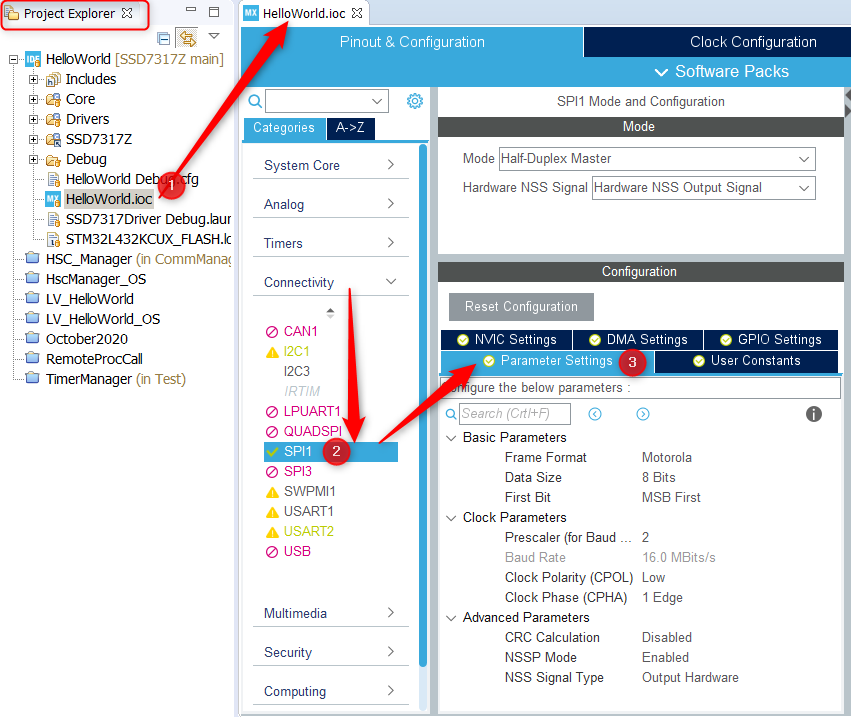

How major parameters are mapped to the SPI format required by SSD7317Z are summarized in a table below.

| SPI format                                       | Parameters                                                   |
| ------------------------------------------------ | ------------------------------------------------------------ |
| Four lines required (D/C#, DCS#, SCLK, and SDIN) | Mode = Half-Duplex Master with Hardware NSS Output Signal<br/>D/C# = OLED_DC<br/>DCS# = OLED_DCS as chip select<br/>SCLK = OLED_SCK<br/>SDIN = OLED_MOSI |
| Minimum tCLKL + tCLKH time = 60ns                | Maximum SPI clock = 16MHz (Baud Rate = 16.0 MBits/s)         |
| Data transferred with MSB first in 8 bits        | Data Size = 8 Bits with First Bit = MSB First                |
| Data transferred on a rising SPI clock           | Clock Polarity (CPOL) = Low  ([SPI Wiki](https://en.wikipedia.org/wiki/Serial_Peripheral_Interface#Clock_polarity_and_phase)) |


When data is interpreted as pixels, the 8 bits transferred from the SPI port are displayed as black (0) or white (1) dots across the same page (e.g. COM95-COM88) at the column pointed to. 

The protocol causes a small issue if we need to display pixels less than a multiple of 8 because the minimum transfer size is one byte (8 bits). 

To solve the issue, a frame buffer is allocated from SRAM of the MCU to map the entire GDDRAM to a linear array: `uint8_t frame_buffer[OLED_VER_RES*(OLED_HOR_RES>>3)]`. Please refer to its definition in `SSD7317.c`.

The first data member `frame_buffer[0]` represents 8 pixels at the top left corner from COM95-COM88 at SEG127, `frame_buffer[1]` maps to COM87-COM80 at SEG127, etc.

## The Frame Buffer

## LCD Image Converter

## The Touch Screen and How It Works

## Scrolling by Hardware

## Porting the Driver to Your MCU

