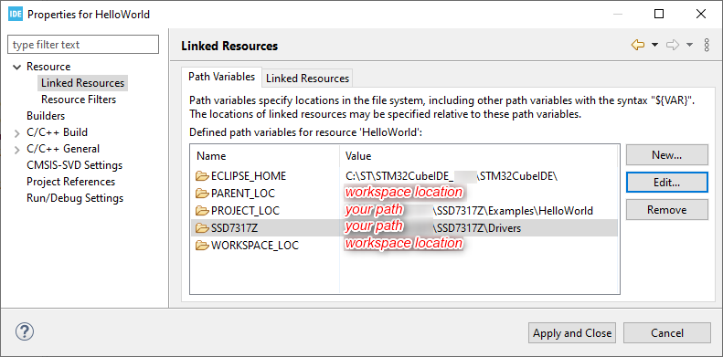
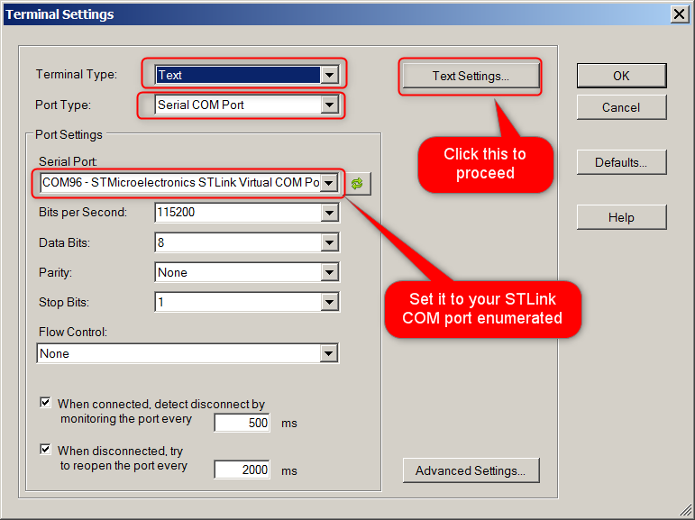
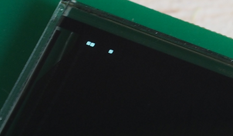
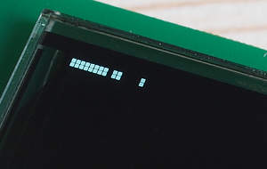
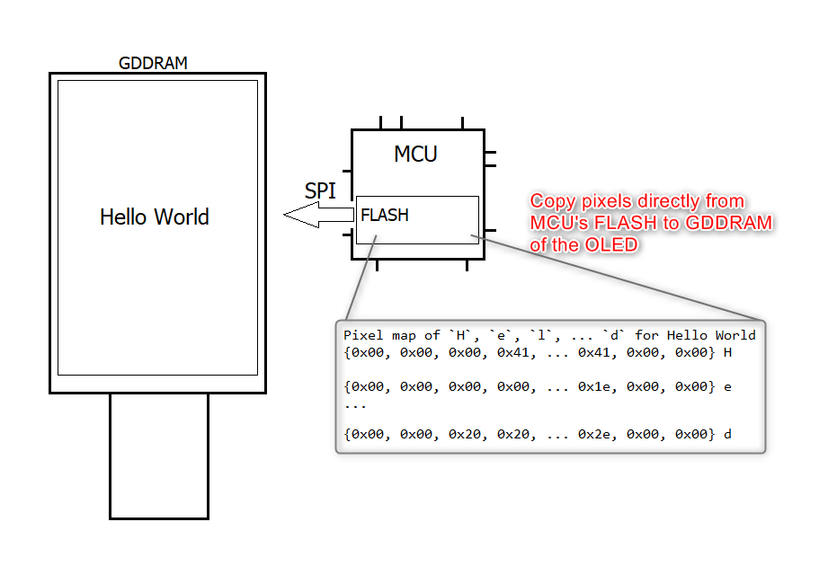
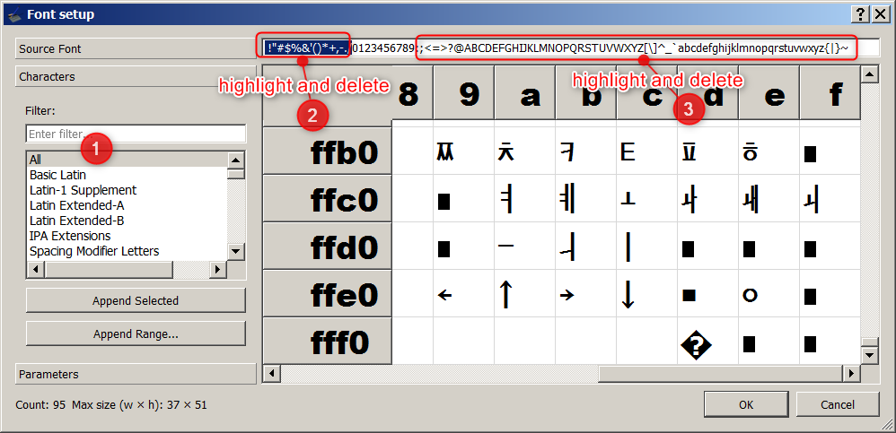
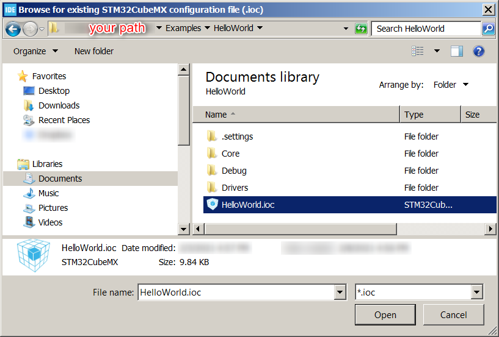
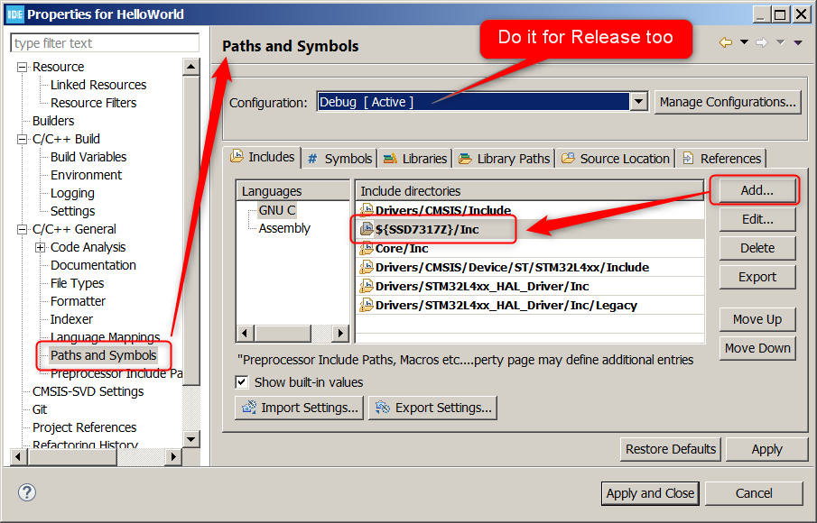
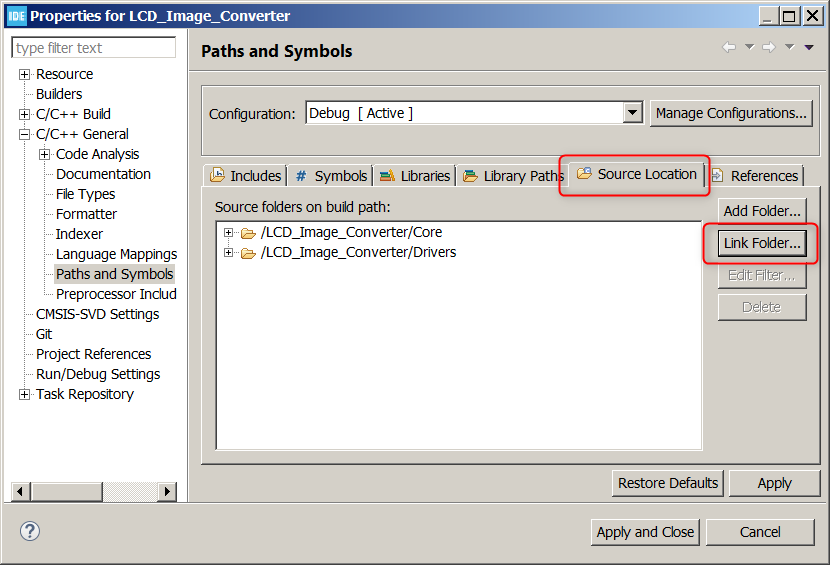

# SSD7317Z
is a controller IC designed by [Solomon Systech Ltd.](https://www.solomon-systech.com/) with touch screen and display controller circuits fabricated on the same die. Photo below shows a conventional *out-cell* screen with separated touch screen and LCD module on the left versus the *in-cell* screen with a single Touch and Display Driver Integration (TDDI) IC driver on the right.


An *out-cell* solution uses a highly conductive and optically transparent Indium Tin Oxide (ITO) printed as grids on a substrate to sense our finger for changes in capacitance. The substrate is bonded to the top glass of the LCD module by some optically clear adhesive [OCA](https://en.wikipedia.org/wiki/Liquid_optically_clear_adhesive). A major advantage of an *out-cell* is flexibility: engineers have the freedom to mix different types of touch screen with a LCD module for different designs. Disadvantages include a larger thickness and weight because the touch substrate is a separate layer that needs OCA to bond it to the top of the LCD module. Additional manufacturing processes also lead to longer production time, more complex quality assurance, higher production cost and yield risks.

Novel *in-cell* solution eliminates the touch and OCA layers altogether. Because there is no external substrate carrying the ITO sensing grids, it turns out a thinner display with better light transmittance can be made. Figures below highlight the difference between the *out-cell* and *in-cell* structures.


**The question is:** how capacitive sensing is performed without an ITO layer? The silicon designer came up with an answer to assign dual functions to the SEG and COM electrodes - for display driving and touch-sense driving. A Time Multiplex Driving Scheme is used to divide display driving and touch sensing period in each frame as shown below.


|                           Marker                           | Description                                                  |
| :--------------------------------------------------------: | ------------------------------------------------------------ |
|  | Display period is started by the onset of a sync pulse on the frame synchronization pin (FR)  as the blanking period (2.7ms) |
|  | Touch-sense driving is triggered by internal circuitry of SSD7317Z in the blanking period |
|  | On a valid touch event, an active-low output signal on the IRQ pin is generated by SSD7317Z with touch and gesture informations encapsulated in form of I<sup>2</sup>C messages (touch report) waiting for readout |
|  | The IRQ signal is handled by the MCU as an interrupt source and the MCU starts reading the touch report |

As yet, do not worry too much on the inner workings and how the waveforms were captured such as why the first I<sup>2</sup>C frame is 0x53 0xF0 0x0A, etc. They will be fully described in following sections with full details (setup, source code, and protocol of the touch report.)

## Our First PMOLED TDDI Display Module - UT2896KSWGG01

is a passive matrix monochrome OLED display of 96*128 with 4 in-cell touch keys, 1-D slide gesture detect and 4 outside keys fabricated by [WiseChip Semiconductor Inc.](https://www.wisechip.com.tw/en/) This repository describes how the novel in-cell display module is interfaced to a popular STM32 M4 MCU and the display and touch drivers developed.


## Hardware Interface to PMOLED Module

Two interface types are required to drive the PMOLED module: SPI for display and I2C for touch screen. There are also GPIOs required for interrupts for FR (frame synchronization) and IRQ (touch event).


## An Evaluation Board

To facilitate the tasks of testing and development, we have designed an evaluation board with the following features:

1. Compatible pin headers for a low-cost and standard evaluation kit of ST MCU [STM32L432KC](https://www.st.com/en/microcontrollers-microprocessors/stm32l432kc.html)
2. Onboard 12V DC-DC generator of Texas Instruments [TPS61040](https://www.ti.com/product/TPS61040) for VCC of the PMOLED module
3. Adjustable LDO [AP2127K-ADJTRG1](https://www.mouser.hk/ProductDetail/Diodes-Incorporated/AP2127K-ADJTRG1/?qs=x6A8l6qLYDB9dJkf7MndUg==) for VCI and VDD so that you may change the voltage output to fit your application processor, just in case it is different from 3.3V
4. Buzzer with a simple NPN driving circuit for audio feedback
5. Test points across major power rails (VCC, VCI, VDD) for measurement on current ratings

The full schematic of the evaluation board is found from this repository at this [link.](./Schematics/UT-2896KSWGG01-WiseChip-EVK-Sch.pdf)


## Setting Up the Integrated Development Environment (IDE)

STM32CubeIDE is an all-in-one development tool released by STMicroelectronics. It is available for 3 operation systems: Linux (Debian, Generic, RPM), macOS, and Windows. Full details on the system requirements and installer packages are available from the hyperlink below:

https://www.st.com/en/development-tools/stm32cubeide.html#get-software

At time of writing the latest version of STM32CubeIDE was 1.5.1. I am using an old version 1.2.0 with updates but it should be compatible with the latest version. In this repository, all examples have been compiled, linked and tested with no error with the host PC running 64-bit Windows 7 and Windows 10, and all programs are confirmed to run on the evaluation board.

In my environment the installation path is set to **C:\ST\STM32CubeIDE_1.2.0** by following the default option. However, you may use any path you find it convenient. In the installation procedures, you will be asked whether to install the SEGGER J-Link drivers, ST_LINK drivers, and ST-LINK server. Check ST_LINK drivers and ST-LINK server with SEGGER J-Link drivers optional. After installation, a desktop shortcut is created.


The STM32CubeIDE is based on [Eclipse](https://en.wikipedia.org/wiki/Eclipse_(software)) that uses a directory called *workspace* to store its preferences and configurations. Every time you run STM32CubeIDE, you will see a dialog box similar to the screen capture below to ask you for the workspace location. In my case, I just follow the recommended path at **C:\Users\John\STM32CubeIDE\workspace_1.2.0** with *John* as my computer user name. It is not mandatory to set the workspace in C drive. You may use other directory at your convenience. From now on, I will refer your installation path as *[your path]*.


Installation of STM32CubeIDE is a straightforward procedure. If you happen to have an issue, the [ST community](https://community.st.com/s/topic/0TO0X000000y2j7WAA/stm32cubeide) is a good place to ask for assistance.

## Download and Build the Hello World Project

Full source code is available from GitHub at https://github.com/techtoys/SSD7317Z. By expanding the button followed by **Download ZIP**, you will get a compressed file "**SSD7317Z-main.zip**".


Unzip the file to any location you like.


Return to STM32CubeIDE, right click on **Project Explorer > Import > General > Existing Projects into Workspace > Next**. From the Import Wizard, click **Browse**  to select the root directory of **HelloWorld** . The project path will be automatically resolved. Click **Finish**  to confirm.


You will see **HelloWorld** under **Project Explorer**. Everything seems fine except there is a yellow exclamation mark on the folder icon of SSD7317Z that means STM32CubeIDE has failed to resolve its location. It is because the device driver of SSD7317Z is located outside of the HelloWorld project as a shared library. Its relative path was set correctly in my PC but it is not set in your environment yet.


To fix the issue, you need to set two variables: **Path Variables** and **Build Variables**. Right click on the project title, from the pop-up menu click on **Properties**.


Expand **Resource > Linked Resources > Path Variables**. Highlight on **SSD7317Z** and click on the **Edit** button to point the path variable of SSD7317Z to the *\Drivers* folder that is the root containing the header *\Inc* and source *\Src* folders of SSD7317Z.



Next, expand **C/C++ Build** > **Build Variables** > set SSD7317Z directory to *\Drivers* folder for Debug and Release configurations. Close by clicking the **Apply and Close** button. You will see the exclamation mark is now resolved to an arrow indicating a relative path.


Now you have successfully configured the IDE. The last step is to build the project by clicking on **Project > Build All** from the IDE's menu bar. Make sure there is no error and observe that HelloWorld.elf and .bin files are built correctly that are required for debug and standalone operations.


To run the project on hardware, connect the MicroUSB port of NUCLEO STM32L432KC to your PC. On the first-time connection you may be asked to upgrade the ST Link firmware and it is no harm to do it.

Click on **Run > Debug** or **F11**, or click on the ladybug icon followed by running the project with **Run > Resume** or **F8**.


In 1-2 seconds you will see the PMOLED show **Hello World** on it.


## How It Works

### Pin Assignment

The wiring diagram between Nucleo L432KC and PMOLED for the display part is shown below.


We need four wires (4-wire SPI) to drive the PMOLED. They are 

- OLED_SCK (serial clock)

- OLED_MOSI (master out slave in)

- OLED_DCS (chip select)

- OLED_DC (data/command selection)

There is no MISO (master in slave out) because the PMOLED is a unidirectional device - SPI data flow from the master (MCU) to slave (PMOLED) only, i.e., it is a half duplex SPI device. 

GPIO PB0 is allocated as an external interrupt detection pin for the display blanking signal (FR) of the OLED module. This pin is optional but highly recommended to avoid display tearing.

Allocation of PA7 as the reset pin is optional because it is required only in system startup. We can afford it since there are spared pins available. If we need to save some MCU pins for future designs, it is possible to use a dedicated reset IC (e.g. STM6321) for the same function. On the evaluation board, that function is performed by a simple RC circuit.

The touch screen interface and its pinout are covered in the section [Touch Screen](#the-touch-screen-and-how-it-works) later. 

### SPI Transfer

Figures below show the SPI timing tables and diagrams excerpt from the OLED's datasheet. Data transmission occurs when DCS# goes low and data is latched on the rising edge of the serial clock with most significant bit (MSB) first. The line D/C# controls whether the byte is a command (D/C#=0) or data (D/C#=1). 


In the source code, two functions: `spi_write_command()` and `spi_write_data()` for command write and data write are provided. OLED (display part) initialization is configured by `spi_write_command()` and pixels are written with `spi_write_data()`.

```c
/**
  * @brief 	SPI command write (non-DMA).
  * @param 	*command points to the command array to send.
  * @param	len is the data length in byte.
  * @return None
  */
void spi_write_command(const uint8_t *command, uint16_t len){
	/*DC pin set low for command send*/
	HAL_GPIO_WritePin(OLED_DC_GPIO_Port, OLED_DC_Pin, GPIO_PIN_RESET);
	/*SPI send with non-DMA method = blocking transfer*/
	HAL_SPI_Transmit(&hspi1, (uint8_t *)command, len, 10);
}
```

```c
/**
  * @brief 	SPI data write (non-DMA).
  * @param 	*data points to the data array to send.
  * @param	len is the data length in byte.
  * @return None
  */
void spi_write_data(const uint8_t *data, uint16_t len){
	/*DC pin set high for data send in next SPI transfer*/
	HAL_GPIO_WritePin(OLED_DC_GPIO_Port, OLED_DC_Pin, GPIO_PIN_SET);
	/*SPI send (non-DMA) = blocking function*/
	HAL_SPI_Transmit(&hspi1, (uint8_t *)data, len, 10);
}
```

### Graphic Display Data RAM
In SSD7317Z there is a memory region known as the Graphic Display Data RAM (GDDRAM) that mapped to each pixel in one-bit depth. The size of GDDRAM is 12*128 bytes with memory divided into 12 pages (PAGE0-PAGE11) with PAGE0 spans from COM95 to COM88, PAGE1 from COM87 to COM80, down to PAGE11 from COM7 to COM0. The memory map on UT2896KSWGG01 is shown below.


The mapping orientation and data scanning direction are configurable by the initialization code that we will go through in the [Program Listing](#program-listing) section. There is a confidential document on **[Data Write Direction](./Docs/SSD7317_128x64_Truly_dataWriteDirection_ToTechtoy.pdf)** if you are interested to change the orientation. 

Transferring one byte (8-bit) to GDDRAM with D/C# line driven high are displayed as pixels across the same page. Which page to address is controlled by start-page address and end-page address with code snippet below:
```C
const uint8_t cmd[3]={0x21,0x00,0x00}; //1) 0x21=SEGMENT address set, 0x00=Start SEGMENT, 0x00=End SEGMENT
spi_write_command((const uint8_t*)cmd, 3); //2) Set SEGMENT address

cmd[0]=0x22; //3) 0x22=COM address set, cmd[1]=cmd[2]=0x00 (no change)
spi_write_command((const uint8_t*)cmd, 3); //4) Set COM address 

const uint8_t data=0xff;
spi_write_data((const uint8_t*)&data, 1); //5) Write pixels
```

Running the code above will switch 8 pixels at the top left corner to WHITE like this:


**Explanation:**

1. `const uint8_t cmd[3]={0x21, 0x00, 0x00}` assigns an array with three elements, the first element `0x21` is the command to set SEGMENT address. The second `0x00` sets the start of SEGMENT address at SEG127. The third `0x00` sets the end of SEGMENT address, in our case, it is also 0 because we are going to set the first PAGE (COM95:COM88) only. Suppose we need to display on two PAGEs across the horizontal direction, the array becomes `const uint8_t cmd[3] = {0x21, 0x00, 0x01}`.

2. `spi_write_command((const uint8_t*)cmd, 3)` sends command with D/C# line driven low. 

   > **NOTE:** There is no need to drive D/C# level high for parameters after 0x21. This is different from other OLED drivers like [SSD1355](http://www.techtoys.com.hk/PIC_boards/PIC18%20OLED%20EVK/PIC18%20OLED%20EVK.htm). The command and subsequent parameters are sent straight through ***without*** D/C# line toggle between 0 and 1.

3. Line 3 `cmd[0]=0x22` sets COM address with `cmd[1]=cmd[2]=0x00` (no change).
4. Line 4 `spi_write_command((const uint8_t *)cmd, 3)` sends over `0x22 0x00 0x00` to set the COM address to the first PAGE.
5. In Line 5, `spi_write_data((const uint8_t*)&data, 1)` is applied to send 0xFF over with D/C# driven high. Result: eight pixels across the horizontal direction are set to WHITE.

**Sending commands to OLED with Remote Procedure Call (RPC)**

To verify the code above, you may download a serial terminal program YAT (YET Another Terminal) from [SOURCEFORGE](https://sourceforge.net/projects/y-a-terminal/) and get it installed. There is a Remote Procedure Call function running in the main loop to convert all serial commands to their equivalent SPI commands. 

Keep the **HelloWorld** program running in debug mode , launch YAT and make sure **Port Settings** (under Terminal Settings) is set to the **STLink Virtual COM Port** enumerated in your PC. In my case it is COM96 but it would be different in your environment. Set baud rate to **115200, 8-n-1** with Flow Control set to None. Terminal Type set to **Text** and Port Type set **Serial COM Port**.



Click **Text Settings...** button to proceed. Set Encoding to some common standard available in your PC. In my case, ASCII(ISO646-US) works fine.

From **EOL (End-Of-Line)**, check **Separate EOL sequences for Tx and Rx** and set \<CR>\<LF> as the EOL sequence. Click **OK**  twice to go back to the main menu. 


Click **Open/Start Terminal** button , check **Str** to display ASCII string in Monitor window. In **Send Text** dialog box, type in `\h (7E 21 00 00 22 00 00)` and click **Send Text (F3)**. 


After **Send Text** you will see the original command echo in the Monitor Window. Toggle between **Str** and **16** to view the difference in String and HEX code.

 

**Annotation:**

`\h` set HEX format in bracket `(...)`

`7E 63` is the header to send all subsequent characters with `spi_write_command(arg)`

`21 00 00 22 00 00` is the body of the command to send. In this case we are sending six bytes in one SPI transfer to set to the start of Segment (SEG=127) and COM address set 0.


Now, type in `\h (7E 64 FF)`  with command header changed to `64` for data and click **Send Text**. You will see 8 pixels at the top left corner with the serial command converted to `spi_write_data(0xff, 1)`.


Closeup on OLED:


Type in `\h(7E 64 86)`, click **Send Text**.



Type in `\h(7E 63 21 00 00 22 00 01)` **Send Text** to bound to two PAGEs in horizontal follow by`\h(7E 64 FF 86)` **Send Text**. Sixteen pixels are displayed with 0xFF as the first 8 pixels, 0x86 as 01100001 with 0=BLACK, 1=WHITE.


Type in `\h(7E 63 21 01 01 22 00 01)` **Send Text** to set it to the second segment (SEG=126) and bound the area to two PAGEs , follow by`\h(7E 64 FF 86)` **Send Text** to write the same 16 pixels to the second row.



> **NOTE:** The top left corner is initialized to (COM95,SEG127) with data write direction set COM95 as the least significant bit (LSB), i.e. byte orientation in LSB first. Because the SPI sending direction was set to MSB first, all data sent is laterally inverted: data write in 0x86 is displayed as a bit pattern like 01100001 with 1=WHITE, 0=BLACK.


### Program Listing

Coming back to the program, listing below shows the code snippet of **HelloWorld**.  There are only 7 lines required to run this program.

```c
int main(void)
{
  HAL_Init(); //1
  SystemClock_Config(); //2
  ssd7317_init(); //3
  rpc_uart_init(); //4
    
  uint16_t w, h;
  ssd7317_get_stringsize(&Tahoma_12h, "Hello World", &w, &h); //5
  ssd7317_put_string((OLED_HOR_RES-w)/2,(OLED_VER_RES-h)/2, &Tahoma_12h,"Hello World",0); //6
  while (1)
  {
	rpc_main_task(); //7
  }
```

**Explanation:**

1. Function `HAL_Init()` is automatically generated by **STM32CubeIDE** to reset all peripherals and initialize the Flash interface of the MCU.  With a **HAL_** prefix it means the function come from the hardware abstraction layer (HAL).
2. `SystemClock_Config()` is also automatically generated by **STM32CubeIDE** to initialize the system clock of the MCU.
3. `ssd7317_init()` is the initialization function of SSD7317Z.
4. `rpc_uart_init()` is the function to initialize the Remote Procedure Call (RPC) module that allows us to input commands from YAT to control the OLED. 
5. Function `ssd7317_get_stringsize(&Tahoma_12h, "Hello World", &w, &h)` returns the width and height of the string `Hello World` from the font `Tahoma_12h` defined in a header file **Tahoma_12h.h**. I will explain how to create the file in the next section [LCD Image Converter](#lcd-image-converter).
6. `ssd7317_put_string((OLED_HOR_RES-w)/2,(OLED_VER_RES-h)/2, &Tahoma_12h,"Hello World",0)` is the key function to align `Hello World` in the center of the screen, update the frame buffer, and get the string displayed on the next FR event. 
7. `rpc_main_task()` is the task of RPC that runs periodically (polling) in the infinite loop.

### The Frame Buffer

The third parameter of the function call to `ssd7317_put_string(left,right,&Tahoma_12h,"Hello World",0)` above is a reference to the structure `const tFont Tahoma_12h` which store 95 characters in the MCU's non-volatile FLASH space. Data elements of character **H** in **Hello World** are:

```c
//0x48 is the ASCII code of H, expand the file Tahoma_12h.h and make a search
static const uint8_t image_data_Tahoma_12h_0x48[14] = { 
    0x00, 
    0x00, 
    0x00, 
    0x41, 
    0x41, 
    0x41, 
    0x41, 
    0x7f, 
    0x41, 
    0x41, 
    0x41, 
    0x41, 
    0x00, 
    0x00
};
```
From a broad perspective, we just need to transfer the byte pattern of **H** `{0x00 0x00 0x00 0x41 ...0x00}` from the MCU's FLASH to OLED's GDDRAM by calling `spi_write_data()` and repeat for the remaining characters to get **Hello World** displayed.
 
There are at least two problems with this approach:

1. Reading from the FLASH is always slower than reading from SRAM of an MCU. A longer data reading time leads to slower pixel rendering
2. Graphical contents of the GUI is not saved

To solve these problems, a frame buffer is declared from MCU's SRAM as a map to the OLED's GDDRAM. Pixels are not written directly to the screen; instead, any graphical content to be updated is written to the frame buffer first and the modified contents in `frame_buffer[]` are flushed from SRAM to GDDRAM by SPI transfer on an FR rising edge to synchronize the blanking period of the OLED. With this approach, the speed of data transfer is faster because it is now data copy from SRAM to OLED's GDDRAM. DMA can be applied to further shorten SPI transfer latency. Synchronization to an FR rising edge also avoids display [tearing](https://en.wikipedia.org/wiki/Screen_tearing). 


For a small display of 96*128 pixels in black and white, the frame buffer occupies an extra 1.5KB out of 64KB SRAM in our target MCU. A more advanced approach is to port the library to some modern graphical frameworks. Examples are [TouchGFX](https://www.st.com/content/st_com/en/stm32-graphic-user-interface.html) and [LVGL](https://lvgl.io/) and both of them need a frame buffer too.

Listing below shows the code snippet of the GPIO external interrupt detection callback that listens to an FR rising edge. The FR signal is an output signal triggered by SSD7317Z in each blanking period of the OLED, that means it is a perpetual output signal determined by the frame rate of the OLED.

```c
//EXTI callback function in SSD7317.c
void HAL_GPIO_EXTI_Callback(uint16_t GPIO_Pin) 
{
	if (GPIO_Pin==OLED_FR_Pin)// FR signal synchronized
	{	// Copy frame buffer to GDDRAM on-the-spot of this interrupt callback if there is pending data to flush
		if(fb_flush_pending_get()){
			fb_spi_transfer(fb_flush_area);
		}
	}
}
```

On an FR-rising edge if there is pending data to flush `(fb_flush_pending_get()==true)`, the function `fb_spi_transfer()` is called to copy `frame_buffer[area]` from MCU's SRAM to OLED's GDDRAM via SPI.

The waveform to draw on the screen for the string **Hello World** was captured by a Logic Analyzer shown below.


By boosting the Logic Analyzer's sampling rate to 100MHz (SPI frequency is 16MHz), we can close up on the SPI data that got written starting from segment address set `0x21`.


To wrap it up, the program works by copying the bit patterns of the string **Hello World** from FLASH to the frame buffer `(frame_buffer[])`, then a flag is set for flush pending to wait for an FR rising edge. On an FR rising edge, the HAL function `HAL_SPI_Transmit()` is applied to copy the dirty area of the frame buffer to GDDRAM of the OLED by SPI.


## LCD Image Converter

is a shareware to create bitmaps and fonts and convert them to "C" source format for embedded applications. It is available from [SOURCEFORGE](https://sourceforge.net/projects/lcd-image-converter/). This section describes the procedures to prepare bitmaps and fonts in "C" arrays and use them in a new project from scratch. 

### Create Fonts in "C" Array

Download and install LCD Image Converter. Double click on **lcd-image-converter.exe**  to launch the application and click **New Font** button.


Enter the font name you want to use. I would suggest a convention that can indicate the font type and size, e.g. ArialBlack_36h.


From **Font setup** dialog box, select the target Fontand Size. I am using Arial Black in size 36 here. By default, the whole typeable character range (0x20 - 0x7E) is selected. To expand or restrict the range, click on the **Characters** button from the lower left corner.


The **Filter** section is now available, select **All**. Matrix table on the right panel is refreshed with the full character range (0x00 - 0xFFFF). In this example, I am going to use only digit "0" - "9" and few special characters. From the text box (next to the **Source Font** button), highlight and delete characters from "space" to "/" and characters ":" to "~" leaving only "0123456789".



To furnish this example, I want to add some Unicode characters to the list. Scroll down the table to select any character you need with double-clicks. I am using Unicode characters 0x26f7, 0x2ee4, 0x30b5, 0x3179, and 0x3296 as demonstration. See the text box is refreshed with new characters added.


Next, click on the **Parameters** button and select Proportional with Fore Color set 0xffffffff and Black Color set 0xff000000. There is no anti-aliasing required because our OLED is a monochrome display.


Click **OK** to exit.

Now, the main menu of LCD Image Converter will show all characters selectedon the right with zoom up on the left.  From Options>. From  the **Options** menu, click on **Conversion...** to open the **Options** dialog menu.


Select **Monochrome** in Preset drop-down menu. Under the **Prepare tab** select **Monochrome**, **Top to Bottom** as the main scan direction and **Forward**as the line scan direction.


**Here comes the tricky part:** we need to laterally invert the bit positions because **pixels are mapped in LSB first** in the [GDDRAM map](#graphic-display-data-ram).

Stay in the **Options** dialog menu, select **Reordering tab** and click on bit '0' button from the Source row and add "Left Shift" by 7 bits. This action is to add a new bitwise operation to shift LSB bit (bit 0) to the MSB position at bit 7.


Repeat the procedures by clicking on bit '1' and left shift by 5 (<<5), on bit '2' and left shift by 3 (<<3), on bit '3' and left shift by 1 (<<1), on bit '4' and right shift by 1 (>>1), on bit '5' and right shift by 3 (>>3), on bit '6' and right shift by 5 (>>5), and finally on bit '7' and right shift by 7 (>>7). 


The result of the series of operations will laterally flip the byte `0b76543210` to `0b01234567`. 

Click **OK** to exit.

Screen captures of the other tabs under **Options** are shown below for reference. An important parameter is **UTF-16** for **Encoding** under **Font tab** because in our list there are Unicode characters.


Click **OK** to exit. 

Finally, click on **File > Convert**, use the suggested file name **ArialBlack_36h.h** to save it as type C/C++ headers (*.h). You may also save the project to ArialBlack_36h.xml from **File > Save** for later use.


### Create Bitmaps in "C" Array 

The procedures to convert a bitmap to "C" Array is similar. On the starting page, open the bitmap file to convert from **File > Open**.


Inspect the conversion parameters from **Options > Conversion**. Make sure the same laterally inverted operation from the last font creation process is applied. Click on **Show Preview** button.


The **Preview** page will show the "C" array starting with 0xff. Data pattern in this configuration will shows a black image on a white background since the OLED is initialized with 1 as WHITE and 0 as BLACK.


We may change it by checking the **Inverse** checkbox from the **Prepare** tab. Click on **Show Preview** again to verify the final "C" array is now with a BLACK(0) background.


Click **OK** twice to exit and save changes when you are asked to do so. 

Finally, convert it to an "C" array by **File > Convert** and save it to the suggested filename **battery-status-full.h**.

## Create a New Project

In this section, we are going to create a new project to display the font and bitmap with "C" arrays from the last section. 

Launch STM32CubeIDE. Right click on any empty area on **Project Explorer > New > STM32 Project from an Existing STM32CubeMX Configuration File (.ioc)**.


Browse to **HelloWorld.ioc** from the last project, click **Open**.



On the STM32 project setup menu, enter a new project name and click **Finish**.


After project creation, STM32CubeIDE will show you the **Pinout view** with screen capture below.


Pinout summary are described in the table below.

| MCU Pinout                                                   | Function                                                    | Interrupt                                       | DMA (Direct Memory Access)                                   | Note                                                         |
| ------------------------------------------------------------ | ----------------------------------------------------------- | ----------------------------------------------- | ------------------------------------------------------------ | ------------------------------------------------------------ |
| PB5(OLED_MOSI)<br/>PB3(OLED_SCK)<br/>PA4(OLED_DCS)<br/>PB1(OLED_DC) | SPI interface for OLED display                              | No                                              | Optional.<br/>Set to DMA1 channel3 with preemption priority level 6 if enabled | **(1)** DMA transfer is not mandatory.<br/>**(2)** Data transfer by DMA will not increase the SPI clock speed. However, using DMA can enhance system performance when there are concurrent tasks.<br/>**(3)** Need to override `DMA1_Channel3_IRQHandler()` in **stm32l4xx_it.c** if DMA is enabled. |
| PB0(OLED_FR)                                                 | GPIO interface for FR output of OLED                        | Yes.<br/>EXTI line0 interrupt enabled for PB0   | No                                                           | **(1)** External interrupt mode with rising edge detected for an FR pulse that is generated by the OLED to indicate blanking periods.<br/>**(2)** Need to override `EXTI0_IRQHandler()` in **stm32l4xx_it.c** |
| PB7(TCH_SDA)<br/>PB6(TCH_SCL)<br/>                           | I2C interface for touch screen                              | No                                              | No                                                           |                                                              |
| PA12(TCH_IRQ)                                                | GPIO interface for IRQ output of touch screen               | Yes.<br/>EXTI line12 interrupt enabled for PA12 | No                                                           | **(1)** External interrupt mode with falling edge detected for IRQ touch event generated by the touch screen.<br/>**(2)** Need to override `EXTI15_10_IRQHandler()` in **stm32l4xx_it.c** |
| PA8(TCH_TRES)                                                | GPIO interface to reset the touch screen                    | No                                              | No                                                           |                                                              |
| PA2(VCP_TX)<br/>PA15(VCP_RX)                                 | Virtual COM Port interface for serial communication with PC | Yes<br/>USART2 global interrupt enabled         | Yes<br/>DMA1 channel6 enabled                                | **(1)** Asynchronous USART mode enabled with DMA for transmitting and receiving debugger messages in the background through serial terminal (115200-8-n-1)<br/>**(2)** Need to override `DMA1_Channel6_IRQHandler()` and `USART2_IRQHandler()` in **stm32l4xx_it.c** |
| PA14(SWCLK)<br/>PA13(SWDIO)                                  | 2-wire ST-LINK debugger interface                           | No                                              | No                                                           | This is enabled by default in STM32CubeIDE                   |
| PA1(PWM)                                                     | Timer2 channel 2 PWM output for buzzer                      | No                                              | No                                                           |                                                              |

One good thing with importing an existing configuration file (*.ioc) is that, **all hardware specific initializations have been automatically generated for you**. There is no coding required to get an error-free program.

Now, copy the files **ArialBlack_36h.h** and **battery-status-full.h** that we have generated from last section to the project. Under Windows environment, expand **Core > Inc**, select the files and drag-and-drop to the **Inc** directory in **Project Explorer**. You will be asked for the options to **Copy files** or **Link to files**. My personal preference is to copy files because I want to keep project specific files in each project. 


Now, expand the **Src** folder, open **main.c** and add the following codes to the project.


> **NOTE:** Append custom code inside *USER CODE BEGIN Includes* and *USER CODE END Includes* markers. All custom code that do not go inside *USER CODE BEGIN xxx* and *USER CODE END xxx* markers will be removed on the next Code Generation if there is any change in Device Configuration Tool.

There is a zip-zap orange underline on `#include "SSD7317.h"` because its file location cannot be resolved yet. We need to let the IDE know where to find the SSD7317 directory. This is the same procedure to set two variables: **Path Variables** and **Build Variables** as that described in [setup](#download-and-build-the-hello-world-project) of Hello World. 

Summary of the procedures are described here:

* Right click on **LCD_Image_Converter** project name > **Properties**
* Expand **Resource > Linked Resources > Path Variables Tab**, click **New** button
* Enter **SSD7317Z** as the name on the menu, click on **Folder** button > browse to \SSD7317Z\Drivers folder > click **Select Folder** button.


* Expand **C/C++ Build > Build Variables**, click **Add** button

* Under **Debug** configuration, enter **SSD7317Z** as the Variable name, set type as **Directory**, and browse to \SSD7317Z\Drivers folder

* Repeat the same procedures for **Release** configuration. Click **Apply and Close** to exit.

  

* Expand **C/C++ General > Paths and Symbols > Includes Tab**, set **${SSD7317Z}/Inc** as a new include directory. Do it for Debug and Release configurations.



* Finally, select **Source Location** tab, click **Add Folder** button to set **SSD7317Z** as the new source location for Debug and Release configurations. Click **Apply and Close**. 

  

The path for SSD7317Z should be resolved now. Add the following code to main.c. Lines inside *USER CODE BEGIN x* and *USER CODE END x* are code to add. 

From the main menu, **Run > Debug**. Click **Resume (F8)** to run the program with listing below:

```c
int main(void){
    HAL_Init();
  	//MX_GPIO_Init(); 
  	//MX_DMA_Init();
  	//MX_USART2_UART_Init();
  	//MX_I2C1_Init();
  	//MX_SPI1_Init();
    //MX_TIM2_Init();
    SystemClock_Config();
    /* USER CODE BEGIN 2 */
    ssd7317_init();	//1

  	ssd7317_put_image(72,0,&batterystatusfull,0); //2
  	ssd7317_put_char(0, 80, &ArialBlack_36h, 0x2ee4, 0); //3
  	ssd7317_put_char(40,80, &ArialBlack_36h, 0x3296, 1); //4
    /* USER CODE END 2 */
    
    /* USER CODE BEGIN WHILE */
  	uint16_t counter = 0;
  	char str[5];
    while(1){
        /* USER CODE END WHILE */
        /* USER CODE BEGIN 3 */
      snprintf(str, 5, "%d", counter); //5
	  if(counter++ > 9999)
	  {
		  counter = 0;
	  }
	  HAL_Delay(50);
	  ssd7317_put_string(0,26,&ArialBlack_36h,str,0); //6
    }
    /* USER CODE END 3 */
}
```

### How It Works

Comment all MX_ codes that are automatically generated by STM32CubeIDE. They have been integrated in `ssd7317_init()` for GPIO, I2C, and SPI initialization

Line 1 	`ssd7317_init()` initializes SSD7317 driver. Place it under SystemClock_Config().

Line 2	`ssd7317_put_image(72,0,&batterystatusfull,0)` displays the battery icon at (72,0)

Line 3	`ssd7317_put_char(0, 80, &ArialBlack_36h, 0x2ee4, 0)` displays the unicode 0x2ee4 at (0,80)

Line 4	`ssd7317_put_char(40,80, &ArialBlack_36h, 0x3296, 1)` displays the unicode 0x3296 inverted at (40,80)

Line 5	`snprintf(str, 5, "%d", counter)` converts the integer `counter` to an array `str[5]` that is compatible with the string argument for `ssd7317_put_string(...,const char *str,...)`

Line 6	`ssd7317_put_string(0,26,&ArialBlack_36h,str,0)` displays the counter value as a string at (0,26)

## The Touch Screen and How It Works

## Scrolling by Hardware

## Porting the Driver to Your MCU

