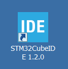
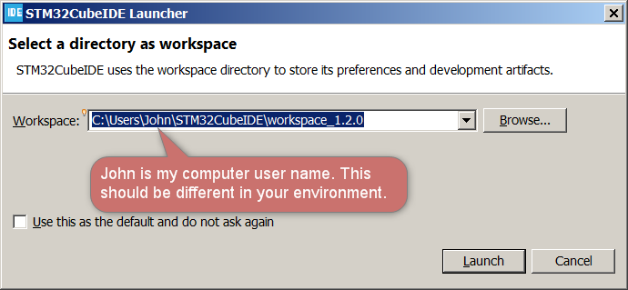

# SSD7317Z
is a controller IC designed by [Solomon Systech Ltd.](https://www.solomon-systech.com/) with touch screen and display controller circuits fabricated on the same die. Photo below shows a conventional *out-cell* screen with separated touch screen and LCD module on the left versus the *in-cell* screen with a single Touch and Display Driver Integration (TDDI) IC driver on the right.

Out-cell solution uses a highly conductive and optically transparent Indium Tin Oxide (ITO) printed as grids on a substrate to sense our fingers for changes in capacitance. The substrate is bonded to the top glass of the LCD module by some optically clear adhesive [OCA](https://en.wikipedia.org/wiki/Liquid_optically_clear_adhesive). A major advantage of using out-cell is flexibility: designers have the freedom to mix different types of touch screen with a LCD module for different designs. Disadvantages include a larger thickness and weight because the touch substrate is a separate layer that needs OCA to bond it to top of the LCD module. Additional manufacturing processes also imply longer production time and more parts for quality assurance that lead to higher production cost and yield risks.

Novel in-cell solution eliminates the touch and OCA layers altogether. Because there is no external substrate carrying the ITO sensing grids, it turns out a thinner display with better light transmittance can be made. Figure below illustrates the structural difference.

The question is: how capacitive sensing is performed without an ITO layer? The silicon designer came up with an answer to assign dual functions to the SEG and COM electrodes - for display driving and touch-sense driving. A Time Multiplex Driving Scheme is used to divide display driving and touch sensing period in each frame as shown below.

|                           Marker                           | Description                                                  |
| :--------------------------------------------------------: | ------------------------------------------------------------ |
|  | Display period is started by the onset of a sync pulse on the frame synchronization pin (FR)  as the blanking period (2.7ms) |
|  | Touch-sense driving is triggered by internal circuitry of SSD7317Z in the blanking period |
|  | On a valid touch event, an active-low output signal on the IRQ pin is generated by SSD7317Z with touch and gesture informations encapsulated in form of I2C messages (touch report) waiting for readout |
|  | The IRQ signal is handled by the MCU as an interrupt source and the MCU starts reading the touch report |

As yet, do not worry too much on the inner workings and how the waveforms were captured such as why the first I2C frame is 0x53 0xF0 0x0A, etc. They will be fully described in following sections with full details (setup, source code, and protocol of the touch report.)

## Our First PMOLED TDDI Display Module - UT2896KSWGG01

is a passive matrix monochrome OLED display of 96*128 with 4 in-cell touch keys, 1-D slide gesture detect and 4 outside keys fabricated by [WiseChip Semiconductor Inc.](https://www.wisechip.com.tw/en/)

## Hardware Interface to PMOLED Module

## An Evaluation Board

To facilitate the tasks of testing and development, we have designed an evaluation board with the following features:

1. Compatible pin headers for a low-cost and standard evaluation kit of ST MCU [STM32L432KC](https://www.st.com/en/microcontrollers-microprocessors/stm32l432kc.html)
2. Onboard 12V DC-DC generator of Texas Instruments [TPS61040](https://www.ti.com/product/TPS61040) for VCC of the PMOLED module
3. Adjustable LDO [AP2127K-ADJTRG1](https://www.mouser.hk/ProductDetail/Diodes-Incorporated/AP2127K-ADJTRG1/?qs=x6A8l6qLYDB9dJkf7MndUg==) for VCI and VDD so that you may change the voltage output to fit your application processor, just in case it is different from 3.3V
4. Buzzer with a simple NPN driving circuit for audio feedback
5. Test points across major power rails (VCC, VCI, VDD) for measurement on current ratings

The full schematic of the evaluation board is found from this repository at this [link.](./Schematics/UT-2896KSWGG01-WiseChip-EVK-Sch.pdf)

## Setting Up the Integrated Development Environment (IDE)

STM32CubeIDE is an all-in-one development tool released by STMicroelectronics. It is available for 3 operation systems: Linux (Debian, Generic, RPM), macOS, and Windows. Full details on the system requirements and installer packages are available from the hyperlink below:

https://www.st.com/en/development-tools/stm32cubeide.html#get-software

At time of writing the latest version of STM32CubeIDE was 1.5.1. I am using an old version 1.2.0 with updates but it should be compatible with the latest version. In this repository, all examples have been compiled, linked and tested with no error with the host PC running 64-bit Windows 7 and Windows 10, and all programs are confirmed to run on the evaluation board.

In my environment the installation path is set to **C:\ST\STM32CubeIDE_1.2.0** by following the default option. However, you may use any path you find it convenient. In the installation procedures, you will be asked whether to install the SEGGER J-Link drivers, ST_LINK drivers, and ST-LINK server. Check ST_LINK drivers and ST-LINK server with SEGGER J-Link drivers optional. After installation, a desktop shortcut is created.

The STM32CubeIDE is based on [Eclipse](https://en.wikipedia.org/wiki/Eclipse_(software)) that uses a directory called *workspace* to store its preferences and configurations. Every time you run STM32CubeIDE, you will see a dialog box similar to the screen capture below to ask you for the workspace location. In my case, I just follow the recommended path at **C:\Users\John\STM32CubeIDE\workspace_1.2.0** with *John* as my computer user name. It is not mandatory to set the workspace in C drive. Again, you may use other directories at your convenience.

Installation of STM32CubeIDE is a straightforward procedure with a lot of manpower and effort given by STMicroelectronics to develop the package. If you happen to have an issue, the [ST community](https://community.st.com/s/topic/0TO0X000000y2j7WAA/stm32cubeide) is a good place to find a solution.

## Download and Build the Hello World Project

Now you see HelloWorld under **Project Explorer**.

Everything seems fine except there is a yellow exclamation mark on the folder icon of SSD7317Z that means STM32CubeIDE has failed to find its location. It is because the device driver of SSD7317Z is located outside of the HelloWorld project as a shared library. Its relative path was set correctly in my PC but it is not set in your environment yet.

To fix the issue, you need to set two variables: **Path Variables** and **Build Variables**. Right click on the project title, from pop-up menu click on **Properties**.

Expand **Resource > Linked Resources > Path Variables**. Click on **Edit** button to point the Path Variable of SSD7317Z to the correct location in your environment. If you are using the same path as procedure above, it will be **D:\xxx\xxx\Drivers**. Please note that the \Drivers folder is the root containing \Inc and \Src folders that contain the header files and source code.

Next, expand **C/C++ Build** > **Build Variables** > set SSD7317Z directory to **D:\xxx\xxx\Drivers** for Debug and Release configurations. Close by clicking the **Apply and Close** button. You will see the exclamation mark is now resolved to an arrow indicating a relative path.

Now you have successfully got the whole IDE fixed. The last step is to build the project by clicking on **Project > Build All** from the IDE's menu bar. Make sure there is no error and observe that HelloWorld.elf and .bin files are built correctly that are required for debug and standalone operations. We have a lot of warnings but they are not significant for now. 

To run the project on hardware, please connect the MicroUSB port of the evaluation to your PC. On the first-time connection you may be asked to upgrade the ST Link firmware and it is no harm to do it.

In 1-2 seconds you will see the PMOLED show the first screen. Feel free to tryout the touch screen by tapping, swipe up and down on the display. Congratulation! You have finished the first project in this repository.

## How It Works

## Porting the Driver to Your MCU

